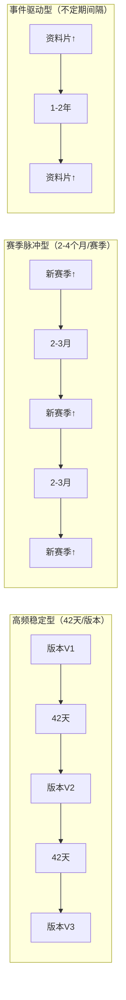

---
tags:
  - 游戏拆解
  - 专题研究
  - 赛季制
  - 版本更新
  - 横向穿刺
---

**定位**：单款游戏的拆解告诉我们“这款游戏的更新节奏是什么样的”，而赛季制与版本更新节奏的横向对比回答的是“什么样的更新节奏能让玩家持续回流”——以及“赛季制的不同设计方式如何影响长线留存”。本专题穿透已拆解的12款游戏，将它们的版本节奏、赛季机制和内容供给模式放在同一张桌上对比，提炼出不同品类、不同生命周期下的更新节奏规律与设计原则。

**适用场景**：为新产品设计赛季/版本节奏时的参考框架、诊断一款游戏的“长草期”问题出在哪里、为面试准备“版本规划/长线运营”类问题的回答弹药、理解“工业化内容生产”与“赛季制”的关系。

## 一、核心概念词典

### 1.1 什么是“赛季制”与“版本更新”？

**赛季制（Season System）** 是游戏以固定的时间周期（通常2-4个月）重置部分玩家进度、推出新内容的运营模式。其核心逻辑是：**“定期归零+定期刷新”** ——让玩家永远有“重新开始”的动机。

**版本更新（Version Update）** 是游戏通过发布新内容（新角色、新地图、新玩法）来维持玩家新鲜感的运营模式。其核心逻辑是：**“持续供给+内容驱动”** ——让玩家永远有“新东西可以玩”。

| 维度 | 赛季制 | 版本更新 |
|:-----|:-------|:---------|
| **核心动作** | 重置进度+推出新内容 | 推出新内容（不一定重置） |
| **玩家动机** | “重新开始”+“新内容” | “新内容” |
| **典型周期** | 2-4个月 | 1-2个月 |
| **适用品类** | 竞技类、SLG、MMO | 内容驱动型所有品类 |

**两者的关系**：赛季制 = 版本更新 + 进度重置。最成功的赛季制设计（如三国志战略版、王者荣耀）都是“版本更新+赛季重置”的组合拳。

### 1.2 更新节奏的三种类型

| 类型 | 定义 | 周期 | 典型案例 |
|:-----|:-----|:----:|:---------|
| **高频稳定型** | 固定周期更新，内容量可预期 | 1-2个月 | 原神（42天）、崩坏3（42天） |
| **赛季脉冲型** | 大版本赛季更新，中间小修补 | 2-4个月 | 三国志战略版、王者荣耀 |
| **事件驱动型** | 内容准备好就发，无固定周期 | 不定 | 单机游戏DLC、EVE资料片 |

### 1.3 赛季重置的“四维模型”

赛季重置涉及四个维度的取舍，每个维度的重置策略决定了玩家的“重新开始”体验：

| 维度 | 重置策略 | 玩家感知 | 典型案例 |
|:-----|:---------|:---------|:---------|
| **资产** | 重置/不重置 | 我的投入是否白费了？ | 三国志战略版：城池重置，武将保留 |
| **进度** | 重置/不重置 | 我是否要重新开始？ | 王者荣耀：段位归零 |
| **内容** | 新增/不变 | 有什么新东西？ | 原神：新版本=新区域+新角色 |
| **奖励** | 重置/不重置 | 打完有什么回报？ | 所有赛季制游戏的赛季奖励 |

## 二、12款游戏的更新节奏与赛季制设计

### 2.1 更新节奏总览矩阵

| 游戏 | 更新周期 | 更新类型 | 是否有赛季重置 | 重置内容 | 内容供给模式 |
|:-----|:--------:|:---------|:--------------:|:---------|:-------------|
| **魔兽世界** | 2年（资料片）+3-4月（小版本）| 事件驱动型 | ❌（资料片有追赶无重置）| — | 资料片+团本 |
| **只狼** | 一次性（后续小更新）| 事件驱动型 | ❌ | — | 买断制单机 |
| **英雄联盟** | 3个月（赛季）+2周（平衡）| 赛季脉冲型 | ✅ | 段位归零 | 新英雄+赛季 |
| **赛博朋克2077** | 一次性（资料片）| 事件驱动型 | ❌ | — | 买断制+DLC |
| **EVE Online** | 1-2年（资料片）| 事件驱动型 | ❌（无赛季概念）| — | 资料片+更新 |
| **梦幻西游** | 1-2年（资料片）| 事件驱动型 | ❌ | — | 资料片+活动 |
| **三国志战略版** | 2-3个月（赛季）| 赛季脉冲型 | ✅ | 城池/建筑归零，武将保留 | 新剧本+新武将 |
| **王者荣耀** | 3个月（赛季）| 赛季脉冲型 | ✅ | 段位归零 | 新英雄+新皮肤 |
| **崩坏3** | 42天（版本）| 高频稳定型 | ✅（深渊/战场）| 深渊/战场排名重置 | 新角色+新活动 |
| **原神** | 42天（版本）| 高频稳定型 | ✅（深渊）| 深渊重置 | 新区域+新角色 |
| **重返未来1999** | 42天（版本）| 高频稳定型 | ❌ | — | 新角色+新剧情 |
| **逆水寒手游** | 3-4个月（赛季）| 赛季脉冲型 | ✅ | 段位/养成进度重置 | 新资料片+新外观 |

### 2.2 更新节奏对比图

### 2.3 不同类型游戏的节奏特征详解

#### 高频稳定型（42天/版本）

**代表游戏**：原神、崩坏3、重返未来1999

|特征|说明|
|---|---|
|**更新周期**|固定42天（约6周），一年约9个大版本|
|**核心内容**|新角色（1-2个）+新活动+新剧情+系统优化|
|**重置内容**|原神：深境螺旋重置；崩坏3：深渊/战场重置|
|**玩家节奏**|版本初期狂欢→版本中期平稳→版本末期长草|
|**内容压力**|极高——每42天必须拿出足够内容|

**规律**：高频稳定型更新需要“工业化内容生产能力”——原神每6周推出新角色+新地图+新剧情，这种节奏是绝大部分游戏无法复制的。

#### 赛季脉冲型（赛季制）

**代表游戏**：王者荣耀、三国志战略版、英雄联盟、逆水寒手游

|特征|说明|
|---|---|
|**更新周期**|2-4个月/赛季，每年3-4个赛季|
|**核心内容**|新赛季主题+新英雄/新武将+赛季奖励|
|**重置内容**|段位/排位归零、部分养成重置|
|**玩家节奏**|赛季初冲分→赛季中平稳→赛季末冲刺|
|**回流效果**|极高——每个赛季都是“重新开始”|

**规律**：赛季制创造的是“竞技循环”——每个赛季初的“重新开始”动机是回流的最强引擎。

#### 事件驱动型（资料片模式）

**代表游戏**：魔兽世界、EVE Online、梦幻西游、赛博朋克2077、只狼

|特征|说明|
|---|---|
|**更新周期**|不稳定，以“准备好”为准|
|**核心内容**|大型资料片/扩展包|
|**重置内容**|无重置（资料片提供追赶机制）|
|**玩家节奏**|资料片发布→内容消费→等待下一个资料片|
|**回流效果**|高但不稳定|

**规律**：事件驱动型更新适合“内容消耗型”游戏（MMO、单机），但“等待周期过长”会导致玩家在版本末期大规模流失。

### 2.4 赛季重置的“保留-重置”策略对比

|游戏|赛季周期|保留内容|重置内容|重置幅度|
|---|---|---|---|---|
|**三国志战略版**|2-3个月|武将+战法|城池+资源+科技+等级|大重置|
|**王者荣耀**|3个月|皮肤+英雄|段位|小重置|
|**逆水寒手游**|3-4个月|外观+部分养成|段位+养成进度|中重置|
|**英雄联盟**|12个月|皮肤+英雄|段位（年度重置）|小重置|
|**崩坏3**|42天|角色+装备|深渊/战场排名|微重置|
|**原神**|42天|角色+装备+地图进度|深渊排名|微重置|

### 2.5 赛季重置的核心规律

**规律一：重置幅度越大，回流效果越强，但留存挑战也越大**

- 三国志战略版（大重置）：每个赛季回流效果极强，但开荒期（前1-2周）的“重新发育”压力导致部分玩家流失
    
- 王者荣耀（小重置）：回流效果稳定，但“和上赛季差不多”的感知会降低“重新开始”的兴奋感
    

**规律二：保留“情感资产”是赛季制的信任底线**

- 玩家可以接受“段位归零”“城池重置”，但不能接受“我花了几千块抽的角色没了”
    
- 所有成功的赛季制游戏都保留了“付费资产”（皮肤/武将/角色/外观）
    

**规律三：赛季制需要“新内容”配合才能最大化回流**

- 单纯的“重置”（如王者荣耀早期赛季）回流效果有限
    
- “重置+新英雄+新皮肤”的组合拳（如王者荣耀当前赛季）回流效果显著
    
- “重置+新剧本+新武将”的组合拳（如三国志战略版）回流效果极强
    

## 三、关键规律提炼

### 3.1 规律一：“42天周期”是内容驱动型游戏的黄金节奏

**现象**：原神、崩坏3、重返未来1999三款内容驱动型游戏均采用42天（约6周）的更新周期。

|游戏|更新周期|核心内容|内容压力|
|---|---|---|---|
|原神|42天|新区域+新角色+新剧情|极高|
|崩坏3|42天|新角色+新活动+新剧情|高|
|重返未来1999|42天|新角色+新活动+新剧情|中高|
|42天节奏的“行业影响”|—|竞品都被带入了42天节奏|—|

**规律**：42天是“开发周期”和“玩家等待耐心”之间的平衡点——

- 长于42天：玩家感到“等太久”，长草期过长
    
- 短于42天：开发团队无法保证内容质量
    

**行业影响**：“竞品都被米哈游带入了42天一个版本的节奏”——《原神》验证了42天节奏的可行性后，大量内容驱动型游戏被迫跟进这个周期。

### 3.2 规律二：“赛季制+新内容”是最强回流组合

**现象**：成功的赛季制游戏（三国志战略版、王者荣耀、逆水寒手游）的核心特征是“赛季重置+新内容”同步上线。

|游戏|赛季组合拳|回流效果|
|---|---|---|
|三国志战略版|新赛季+新剧本+新武将+城池重置|极高|
|王者荣耀|新赛季+新英雄+新皮肤+段位重置|极高|
|逆水寒手游|新赛季+新资料片+新外观+段位重置|高|

**规律**：如果“赛季重置”没有配套新内容，回流效果会显著下降——玩家感知“只是重复打一遍”。

**可验证结论**：赛季重置=重新开始的动机；新内容=回流的理由。两者缺一不可。

### 3.3 规律三：“版本末期长草期”是内容驱动型游戏的共性风险

**现象**：所有内容驱动型游戏（原神、崩坏3、重返未来1999）都存在“版本末期长草期”——玩家在新版本内容消耗完后，等待下一个版本的空白期。

|游戏|长草期特征|玩家流失风险|缓解手段|
|---|---|---|---|
|原神|版本最后1-2周|中|预热活动+前瞻直播|
|崩坏3|版本最后1周|中|版本活动延续|
|重返未来1999|版本最后1-2周|中高|活动填充|
|三国志战略版|赛季最后1-2周|中|赛季末结算驱动|
|王者荣耀|赛季最后1-2周|低|赛季末冲分驱动|

**规律**：长草期的本质是“内容消耗速度>内容生产速度”——玩家消耗内容的速度总是快于开发团队生产内容的速度。

**设计启示**：缓解长草期的有效手段包括：

- 赛季末结算奖励（三国志战略版、王者荣耀）
    
- 版本预热活动（原神前瞻直播）
    
- 随机性内容（EVE的玩家自驱事件）
    
- 社交内容（魔兽世界的公会社交）
    

### 3.4 规律四：工业化内容生产能力是“高频稳定更新”的前提

**现象**：原神能保持42天版本节奏的核心原因是**工业化内容生产能力**——米哈游拥有数千人的研发团队和高度标准化的内容生产流程。

|能力维度|原神|崩坏3|重返未来1999|一般游戏|
|---|---|---|---|---|
|团队规模|数千人|数百人|数百人|数十-数百人|
|内容管线|工业化|工业化|半工业化|非标准化|
|新版本内容量|新区域+角色+剧情+活动|角色+活动+剧情|角色+剧情+活动|不定|

**规律**：42天版本的真正壁垒不是“创意”，而是“工业化”——能否在固定周期内稳定产出高质量内容，决定了是否能保持高频更新。

### 3.5 规律五：买断制单机的“更新节奏”与“长线”无关

**现象**：只狼、赛博朋克2077等买断制单机游戏，其“更新节奏”不服务于“长线留存”，而是服务于“内容扩展”和“口碑修复”。

|游戏|更新模式|目的|长线留存|
|---|---|---|---|
|只狼|一次性+Boss模式更新|内容扩展|不适用|
|赛博朋克2077|首发+DLC+大修复|口碑修复+内容扩展|不适用|

**规律**：买断制单机的“更新”不解决“留存”问题——玩家通关即走是正常现象，不需要通过“长线运营”来改变。

## 四、赛季制与版本更新的设计工具包

### 4.1 赛季制设计的五个关键决策

|决策|问题|可选方案|推荐|
|---|---|---|---|
|**赛季周期**|多久一个赛季？|42天/2个月/3个月/4个月|竞技类3个月；内容型42天|
|**重置幅度**|重置什么？|大重置/中重置/小重置|保留付费资产，重置进度|
|**新内容量**|每个赛季有多少新东西？|新角色/新地图/新玩法|至少1个新英雄/新角色|
|**奖励机制**|打完赛季给什么？|皮肤/称号/资源|专属皮肤+资源|
|**赛季间衔接**|赛季间如何过渡？|休赛期/预热期|1-2周缓冲期|

### 4.2 各品类的赛季制推荐参数

|品类|推荐周期|重置内容|新内容量|赛季奖励|典型案例参考|
|---|---|---|---|---|---|
|**MOBA/竞技**|3个月|段位归零|新英雄1-2个|赛季皮肤|王者荣耀|
|**SLG/策略**|2-3个月|城建归零，武将保留|新剧本+新武将|霸业/割据奖励|三国志战略版|
|**MMO/角色扮演**|3-4个月|段位+养成进度|新资料片内容|赛季称号+资源|逆水寒手游|
|**内容驱动型**|42天|深渊/排行重置|新角色+新剧情|抽卡资源|原神|
|**买断制单机**|不适用|不适用|不适用|不适用|—|

### 4.3 缓解“长草期”的五种策略

|策略|说明|适用品类|案例|
|---|---|---|---|
|**赛季末冲刺**|赛季末开放额外奖励|竞技类、SLG|王者荣耀赛季末冲分|
|**版本预热**|提前释放新版本信息|所有内容型|原神前瞻直播|
|**社区/赛事**|赛事内容填充空白|竞技类|英雄联盟全球总决赛|
|**玩家自驱事件**|玩家自身创造内容|社交类|EVE玩家战争|
|**小型活动**|填充间隙的轻量内容|所有F2P|各种限时小活动|

## 五、总结

### 5.1 核心结论

1. **赛季制是“竞技类+策略类”游戏的长线引擎**：王者荣耀、三国志战略版、英雄联盟证明了“赛季重置=持续回流”的有效性。赛季制的核心价值是“重新开始”的动机，而非“新内容”本身。
    
2. **42天版本节奏是“内容驱动型”游戏的黄金周期**：原神、崩坏3验证了42天/版本是“开发周期”和“玩家等待耐心”之间的平衡点。但42天节奏的前提是“工业化内容生产能力”。
    
3. **“赛季重置+新内容”是回流的最强组合**：只有重置没有新内容=“只是重复打一遍”；只有新内容没有重置=“玩家可能不会回来”。两者缺一不可。
    
4. **买断制单机游戏不适用赛季制或版本节奏分析**：只狼、赛博朋克2077的“更新”服务于“内容扩展”和“口碑修复”，不服务于“长线留存”——玩家通关即走是正常现象。
    
5. **“版本末期长草期”是所有内容驱动型游戏的共性风险**：本质是“内容消耗速度>内容生产速度”。缓解长草期的有效手段包括赛季末冲刺、版本预热、赛事内容、玩家自驱事件和小型活动。
    

### 5.2 可迁移的设计要点

1. **赛季制设计**：至少包含“新内容+重置机制+赛季奖励”三要素
    
2. **版本节奏**：内容驱动型游戏优先采用42天/版本，竞技型游戏优先采用3个月/赛季
    
3. **重置策略**：重置“可重复获得”的进度（段位/城建），保留“付费获得”的资产（皮肤/角色）
    
4. **长草期管理**：在版本/赛季末期安排冲刺活动或预热内容
    
5. **工业化内容生产**：42天节奏的前提是“标准化内容管线”，量力而行
    

## 六、关联笔记

- [[90-2-1-1 拆解总索引_MOC]]
    
- [[90-2-1-3 拆解维度标准SOP#1.7 第5层：长线留存机制]]
    
- [[90-2-1-4 【模板】单款游戏深度拆解卡片#七、第5层：长线留存机制]]
    
- [[90-2-1-20 专题_DAU曲线与弃坑拐点分析]]（赛季制与DAU曲线的关系）
    
- [[90-2-1-21 专题_社交结构金字塔]]（赛季重置与社交结构的关系）