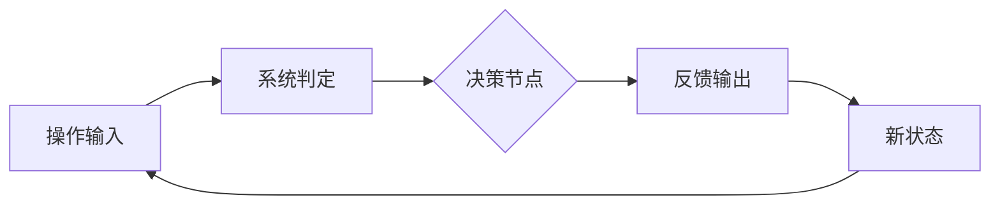

**定位**：这是整个拆解体系的“施工图纸”——所有后续游戏拆解报告都必须基于这个模板填充。模板的设计遵循[[90-2-1-3 拆解维度标准SOP]]的6层逻辑，同时融合[[90-2-1-2 底层驱动分类图谱]]的分类思想。这个模板回答三个问题：每一篇拆解报告的长什么样？每一层具体要填什么内容？如何确保不同人写的拆解报告具有可比性？

**适用场景**：开始拆解任何一款新游戏时的“起手式”；确保团队多人协作时的输出一致性；作为拆解报告的“完整性检查清单”；需要快速了解一款游戏的标准化摘要时。

## 一、使用说明

### 1.1 模板使用规则

| 规则       | 说明                                                    |
| :------- | :---------------------------------------------------- |
| **必填项**  | 标题中的游戏名和副标题、YAML属性、第1层核心循环的“最小循环描述”                   |
| **选填项**  | 部分维度可能不适用（如单机游戏无社交层），可标注“不适用”并说明理由                    |
| **权重分配** | 根据[[90-2-1-2 底层驱动分类图谱]]中的驱动类型，调整各章节篇幅。5星维度写详细，2星维度写概要 |
| **数据支撑** | 能用数字的地方不用形容词（帧数/秒数/概率/倍率优先）                           |
| **系统拆解** | **本模板采用系统视角，不将游戏的成功归因于单一因素，而是要求描述各要素之间的协同关系。**        |

### 1.2 文档命名规范

**格式**：
`90-2-1-{序号} {游戏名}_{因素A}、{因素B}与{因素C}的系统协同/耦合/机制.md`
**说明**：
- 因素A：最显著的体验入口（操作/数值/内容/社交中的1-2个）
- 因素B：另一个关键维度
- 因素C：长线留存相关维度
- 后缀：描述它们的关系（协同/耦合/机制）
**示例**：
- `90-2-1-14 王者荣耀_操作手感、社交生态与赛季运营的系统协同.md`
- `90-2-1-16 原神_战斗系统、内容更新与IP传播的系统协同.md`

## 一、基本信息

| 项目 | 内容 |
|:-----|:-----|
| **游戏名称** | |
| **开发商/发行商** | |
| **上线日期** | |
| **平台** | |
| **底层驱动（主导）** | |
| **底层驱动（次要）** | |
| **商业化模式** | |
| **拆解版本** | |
| **拆解日期** | |

## 二、拆解侧重点说明

> 根据[[90-2-1-2 底层驱动分类图谱]]和[[90-2-1-3 拆解维度标准SOP]]的权重分配，本篇报告的分析重心如下：

| 维度 | 权重 | 说明 |
|:-----|:----:|:-----|
| 第1层：核心循环（分钟级） | ★★★★★ | [说明为什么重点拆这一层] |
| 第2层：成长循环（天/周级） | ★★★ | [说明分析深度] |
| 第3层：商业化设计 | ★★★★ | [说明分析深度] |
| 第4层：社交结构 | ★★ | [说明分析深度，或不适用] |
| 第5层：长线留存机制 | ★★★ | [说明分析深度] |
| 第6层：美术/UI/信息传达 | ★★ | [说明分析深度] |

## 三、第1层：核心循环（分钟级）

> **定义**：玩家在游戏中最基本的“操作-反馈-决策”单元。参考[[90-2-1-3 拆解维度标准SOP#1.3 第1层：核心循环]]。

### 3.1 最小循环描述

> **必填项**。用一段话描述从“操作发生”到“反馈出现”的完整链条。

### 3.2 循环结构图

### 3.3 关键参数

|参数|数值|说明|
|---|---|---|
|单次循环时长|||
|操作到反馈的延迟||动作类游戏需精确到帧（1帧=0.033秒@30fps）|
|循环中的决策点数量|||
|随机元素占比||低/中/高，说明随机在循环中的作用|

### 3.4 爽感来源分析

> 玩家在这个循环中“爽”在哪里？是哪个瞬间触发了多巴胺？

[在此描述]

### 3.5 潜在疲劳点

> 这个循环在什么情况下会变得无聊？重复多少次后开始产生厌倦感？

[在此描述]

## 四、第2层：成长循环（天/周级）

> **定义**：玩家在每日/每周时间尺度上的行为模式。参考[[90-2-1-3 拆解维度标准SOP#1.4 第2层：成长循环]]。

### 4.1 每日必做（Daily）

|行为|耗时|奖励|驱动力类型|
|---|---|---|---|
|[行为1]|||[数值/资源/社交/内容]|
|[行为2]||||
|[行为3]||||

### 4.2 每周目标（Weekly）

|目标|重置周期|奖励|是否强制|
|---|---|---|---|
|[目标1]|||是/否|
|[目标2]||||

### 4.3 资源循环图

text

[产出源] → [资源A] → [消耗途径1]
                  → [消耗途径2] → [能力提升] → [解锁新产出源]

[文字说明资源闭环的逻辑]

### 4.4 断档期识别

> 玩家在什么情况下会出现“不知道干什么”的状态？

[在此描述]

### 4.5 长线目标

> 玩家在3个月/6个月/1年维度上的追求是什么？

|时间维度|核心目标|进度可视化方式|
|---|---|---|
|3个月|||
|6个月|||
|1年|||

## 五、第3层：商业化设计

> **定义**：游戏如何将玩家体验转化为收入。参考[[90-2-1-3 拆解维度标准SOP#1.5 第3层：商业化设计]]。

### 5.1 付费入口总览

|付费类型|付费形式|对应心理账户|价格区间|
|---|---|---|---|
|首充||||
|月卡/通行证||||
|抽卡/开箱||||
|直购皮肤/道具||||
|体力/资源购买||||

### 5.2 核心付费路径

> 描述玩家从“免费用户”到“付费用户”再到“持续付费用户”的转化路径。

[在此描述]

### 5.3 付费深度分析

|维度|数据|说明|
|---|---|---|
|零氪vs满氪战力差距|约X倍||
|单角色/单武器毕业期望花费|||
|满图鉴/全收集期望花费|||
|是否有付费上限|是/否||

### 5.4 付费与体验的关系

> 付费是“加速循环”还是“绕过循环”？付费玩家和免费玩家的核心体验差异在哪里？

[在此描述]

### 5.5 诱导性设计识别

|设计手法|是否存在|具体表现|
|---|---|---|
|首充双倍/限时优惠|||
|概率展示（保底/随机）|||
|限时卡池/限定皮肤|||
|沉没成本诱导|||
|社交展示（付费身份的可见性）|||

## 六、第4层：社交结构

> **定义**：游戏如何组织和定义玩家之间的关系。参考[[90-2-1-3 拆解维度标准SOP#1.6 第4层：社交结构]]。

### 6.1 社交层级图

### 6.2 社交驱动力分析

|社交形式|是否强制|核心驱动力|回报类型|
|---|---|---|---|
|好友/关注||||
|组队/联机||||
|公会/帮派||||
|阵营/势力||||

### 6.3 社交身份的可见性

> 玩家的社交身份（段位/头衔/公会职位/氪金标志）如何被展示？被谁看到？

[在此描述]

### 6.4 负面社交处理

> 游戏如何处理PVP恶意、霸凌、欺诈等问题？

[在此描述]

## 七、第5层：长线留存机制

> **定义**：游戏如何让玩家在“玩了一个月之后”仍然愿意留下来。参考[[90-2-1-3 拆解维度标准SOP#1.7 第5层：长线留存机制]]。

### 7.1 内容更新节奏

|更新类型|频率|内容量|预告周期|
|---|---|---|---|
|大版本||||
|小版本||||
|活动||||

### 7.2 第30天 vs 第180天的留存驱动力

|时间节点|核心驱动力|玩家状态|
|---|---|---|
|第30天|||
|第180天|||

### 7.3 回归机制

|机制|描述|效果评估|
|---|---|---|
|回归奖励|||
|追赶机制|||
|好友召回|||

### 7.4 退出成本分析

> 玩家离开这款游戏时，“舍不得”的是什么？

[在此描述]

### 7.5 终局内容

> 玩家消耗完所有主线内容后，还有事可做吗？

[在此描述]

## 八、第6层：美术/UI/信息传达

> **定义**：视觉和界面设计如何服务于“让玩家看懂、融入、不疲倦”。参考[[90-2-1-3 拆解维度标准SOP#1.8 第6层：美术/UI/信息传达]]。

### 8.1 审美调性分析

|维度|描述|是否服务于核心体验|
|---|---|---|
|整体美术风格||是/否|
|色彩倾向|||
|角色设计语言|||
|场景/环境风格|||
|UI视觉风格|||

### 8.2 UI效率分析

|常用操作|操作步骤数|是否合理|
|---|---|---|
|[操作1]|||
|[操作2]|||

### 8.3 信息传达效率分析

|信息类型|传达方式|响应速度|是否清晰|
|---|---|---|---|
|血量/状态变化||||
|技能冷却||||
|任务/目标提示||||
|战斗反馈（伤害/受击）||||

### 8.4 优秀设计与可改进点

**优秀设计（≥3处）**：

1. [设计1]
    
2. [设计2]
    
3. [设计3]
    

**可改进点（≥3处）**：

1. [改进点1]
    
2. [改进点2]
    
3. [改进点3]
    

## 九、弃坑拐点分析

> 这款游戏在什么阶段、什么原因下会让玩家流失？这是拆解中最重要的“反向视角”。

|阶段|典型流失原因|机制层面是否存在预防设计|
|---|---|---|
|新手期（前1-3天）|||
|成长期（第1-2周）|||
|成熟期（第1-2月）|||
|长线期（3月以上）|||

## 十、横向穿刺锚点

> 列出本报告中可被横向对比的“关键数据点”，供[[90-2-1-5 【模板】横向对比分析报告]]和专题文档引用。

|锚点|本游戏数据|关联专题|
|---|---|---|
|核心循环时长|||
|每日必做耗时|||
|首充金额/回报率|||
|月卡/通行证价格与回报|||
|单角色/单武器毕业期望花费|||
|零氪与满氪战力差距|||
|公会人数上限|||
|大版本更新周期|||
|回归奖励规模|||
|第30天vs第180天留存驱动力|||

## 十一、系统因果分析

> **本章为必填项，是本模板的核心章节。**

### 11.1 因果网络图（含Mermaid图）

### 11.2 入口/核心/放大器分层说明

| 层级 | 包含要素 | 作用 |
|:-----|:---------|:-----|
| **入口层** | [因素1]、[因素2]、[因素3] | 降低用户获取成本，制造第一印象 |
| **核心层** | [因素4]、[因素5]、[因素6] | 创造持续游玩的动机，形成习惯 |
| **放大器层** | [因素7]、[因素8]、[因素9] | 驱动口碑传播、社交裂变、长线回流 |

### 11.3 必要非充分说明

> **必填项**。明确声明单一因素不足以解释游戏的成功或失败。

### 11.4 系统脆弱性识别

> 哪个环节崩了会导致系统坍塌？

### 11.5 正向循环 vs 恶性循环

> 描述各因素之间如何形成正向循环（增长飞轮），以及什么情况下会逆转为恶性循环。

## 十二、总结

### 12.1 一句话评价

[用一句话概括这款游戏最核心的特征和拆解发现]

### 12.2 核心发现（3-5条）

> **注意**：每条发现应体现“系统视角”，说明因素之间的协同关系，而非孤立陈述。

1. [发现1：体现因素A与因素B的协同关系]
2. [发现2：体现因素C对因素A/B的强化作用]
3. [发现3：体现系统的正向循环或脆弱性]

### 11.3 可借鉴的设计点

1. [借鉴点1]
    
2. [借鉴点2]

### 11.4 需警惕的陷阱

1. [陷阱1]
    
2. [陷阱2]

## 十二、关联笔记

- [[90-2-1-1 拆解总索引_MOC]]
- [[90-2-1-2 底层驱动分类图谱]]
- [[90-2-1-3 拆解维度标准SOP]]
- [[90-2-1-19 专题_付费心理学模型对比]]
- [[90-2-1-20 专题_DAU曲线与弃坑拐点分析]]
- [[90-2-1-21 专题_社交结构金字塔]]
- [[90-2-1-22 专题_赛季制与版本更新节奏研究]]
-