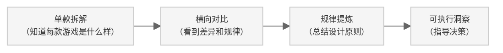

**定位**：单款游戏的深度拆解解决的是“这款游戏好在哪里”的问题，而横向对比分析解决的是“好游戏的规律是什么”的问题——后者才是“体系”的价值所在。没有横向对比，12款游戏的拆解报告只是12份独立文档，有了横向对比，它们才能拼接成一张完整的游戏设计地图。这个模板回答三个问题：横向对比分析要对比什么？怎么保证对比的公平性？对比完之后能产出什么有价值的东西？

**适用场景**：拆解完多款游戏后的“拼图时刻”；同一驱动类型内找设计规律；跨驱动类型找差异化空间；为立项决策提供参考依据；为面试准备“竞品分析”类问题的回答弹药。


## 一、核心概念词典


### 1.1 什么是横向对比分析？

**横向对比分析**是将多款游戏在同一个维度上“并排放置”进行比较的方法——它不追求每一款游戏的深度，而追求“在同一尺度上看到差异和规律”。

**对比的三种类型**：

| 类型 | 定义 | 适用场景 | 示例 |
|:-----|:-----|:---------|:-----|
| **同驱动类型对比** | 同一底层驱动下，不同游戏的设计差异 | 找品类规律、识别创新点 | 《只狼》vs《王者荣耀》vs《崩坏3》（都是操作心流型，但设计逻辑完全不同）|
| **跨驱动类型对比** | 不同底层驱动下，同一维度的表现差异 | 找设计边界、识别品类特性 | 数值型vs内容型vs社交型的“第3层商业化”对比 |
| **同维度穿刺对比** | 专门针对一个维度（如付费），穿透所有游戏 | 深度研究单一设计问题 | 12款游戏的“首充设计”横向对比（对应专题类文档）|

**对比分析的价值链**：


### 1.2 对比框架：三个核心维度

横向对比不是“把两份报告并排放一起读”，而是有结构地在一个统一框架下进行比较。

**对比的三维框架**：

| 维度       | 核心问题            | 比较对象                |
| -------- | --------------- | ------------------- |
| **数据维度** | 数字上有什么差异？       | 数值、时长、概率、价格等可量化指标   |
| **机制维度** | 设计逻辑上有什么不同？     | 规则、系统、流程等可描述性结构     |
| **效果维度** | 对玩家体验产生了什么不同影响？ | 留存、付费、口碑、社区文化等可观察结果 |

```
%%{init: {
  'theme': 'base',
  'themeVariables': {
    'fontSize': '9px',
    'primaryColor': '#f5f5f5',
    'primaryBorderColor': '#ccc',
    'lineColor': '#666'
  },
  'flowchart': {
    'nodeSpacing': 20,
    'rankSpacing': 30,
    'padding': 8
  }
}}%%
graph TD
    D["数据维度<br>（数字差异）"] --> M["机制维度<br>（设计逻辑差异）"]
    M --> E["效果维度<br>（玩家体验差异）"]
    D -.->|"交叉验证"| E
```


