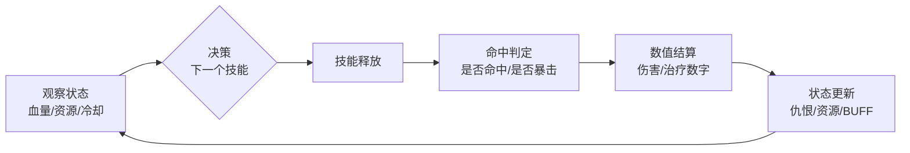
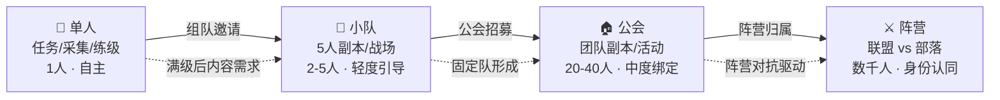
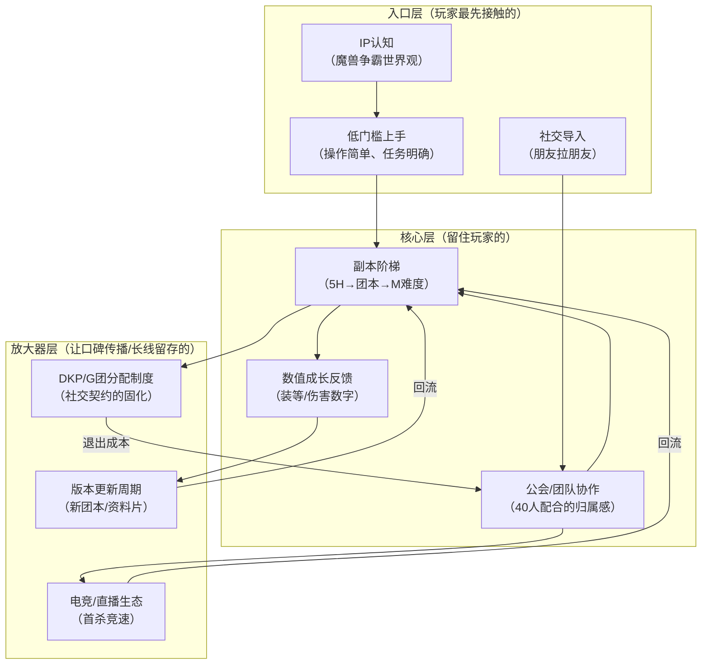

# 魔兽世界：数值体系、团队协作与长线运营的系统协同

## 一、基本信息

| 项目 | 内容 |
|:-----|:-----|
| **游戏名称** | 魔兽世界（World of Warcraft） |
| **开发商/发行商** | 暴雪娱乐 |
| **上线日期** | 2004-11-23（美服）/ 2005-06（国服） |
| **平台** | PC |
| **底层驱动（主导）** | 数值策略型 |
| **底层驱动（次要）** | 社交经济型 |
| **商业化模式** | 时长付费（月卡/季卡/半年卡）|
| **拆解版本** | [待填写] |
| **拆解日期** | [待填写] |

## 二、拆解侧重点说明

> 根据[[90-2-1-2 底层驱动分类图谱]]和[[90-2-1-3 拆解维度标准SOP]]的权重分配，本篇报告的分析重心如下：

| 维度 | 权重 | 说明 |
|:-----|:----:|:-----|
| 第1层：核心循环（分钟级） | ★★ | 魔兽的核心体验不在单次战斗的操作精度，而在战前配装与战中决策；单体循环相对固定 |
| 第2层：成长循环（天/周级） | ★★★★★ | 满级后的副本阶梯（5人本→团本）、装备等级（装等）爬升是核心成长驱动力 |
| 第3层：商业化设计 | ★★ | 时长付费相对单一，重点分析月卡定价策略与怀旧服的双轨制 |
| 第4层：社交结构 | ★★★★★ | DKP/G团分配制度、公会组织架构、40人团的协作成本与凝聚力 |
| 第5层：长线留存机制 | ★★★★ | 版本更新节奏（资料片）、怀旧服策略、社交退出成本 |
| 第6层：美术/UI/信息传达 | ★★ | 团队框架、仇恨监控、DBM等插件生态对游戏体验的重构 |

> **系统视角声明**：本报告采用系统视角，不将游戏的成功或失败归因于单一因素，而是试图描述各要素之间的协同、耦合与相互强化关系。各章节的分析结论将在“第十一章 系统因果分析”中整合为完整的因果网络图。

## 三、第1层：核心循环（分钟级）

> **定义**：玩家在游戏中最基本的“操作-反馈-决策”单元。参考[[90-2-1-3 拆解维度标准SOP#1.3 第1层：核心循环]]。

### 3.1 最小循环描述

《魔兽世界》的战斗核心循环为“技能选择→目标判定→施法/瞬发→命中/未命中判定→伤害/治疗数字→仇恨更新→下一个技能”。单次技能循环约1.5秒（GCD，公共冷却时间）至数分钟（大招冷却）。不同职业的循环复杂度差异极大——法师可能只需2-3个技能反复使用，而盗贼/猫德需要监控多个能量/连击点/增益状态的联动。

典型循环链条：

### 3.2 关键参数

|参数|数值|说明|
|---|---|---|
|单次循环时长|1.5秒（GCD）- 数分钟（大招）|GCD是魔兽战斗节奏的基础“心跳”|
|操作到反馈的延迟|约50-100ms（含网络延迟）|MMORPG对延迟容忍度高于动作游戏|
|循环中的决策点数量|2-5个|不同职业差异大，惩戒骑约2个，猫德约5+个|
|随机元素占比|中|暴击/未命中/招架/躲闪构成随机层；高玩通过“阈值配装”对冲随机性|

### 3.3 爽感来源分析

魔兽战斗的爽感不来自“一秒五刀”的操作快感，而来自“数字跳出的瞬间”——暴击数字的视觉冲击、斩杀阶段的高伤害、团队血线被抬满的安心感。爆击数字（尤其是“爆击！”字样的大号字体）是经典的多巴胺触发器，配合音效和屏幕震动，形成即时正反馈。另一个爽感来源是“技能优先级的最优执行”——当你在复杂的战斗环境中完美打出技能循环时，DPS（秒伤）排名上升产生的“我玩明白了”的智力满足感。

### 3.4 潜在疲劳点

核心循环的疲劳点在于“重复感”——当玩家已经熟练掌握了技能循环，且战斗流程相对固定（如木桩型Boss），每一次循环变成“肌肉记忆”而非“决策”，游戏的即时趣味就会下降。这也是为什么魔兽在团本中引入大量移动战、转火、躲避机制——打断循环的“惯性”，迫使玩家重新进入决策状态。

### 3.5  与其他层的交互

|关联层|交互关系|
|---|---|
|第2层（成长循环）|核心循环中的“每秒伤害/治疗量”是装备升级的直接反馈——新装备让数字跳得更高，数字更高驱动玩家追求下一件装备|
|第3层（商业化）|时长付费模式下，核心循环的“耗时”直接影响用户时长消费——但战斗本身不设付费加速，保证了循环体验的公平性|
|第4层（社交结构）|团本中的40人协作要求每个人的循环“不出错”——个人的循环质量影响团队的整体进度，社交压力反过来驱动玩家精进循环|
|第5层（长线留存）|核心循环的“操作天花板”（如猫德“神像舞”）为长线玩家提供了持续的“精进空间”|
|第6层（UI/信息）|团队框架、仇恨插件、DBM等外部工具重构了核心循环的信息获取方式——玩家不再只看游戏原生UI|

## 四、第2层：成长循环（天/周级）

> **定义**：玩家在每日/每周时间尺度上的行为模式。参考[[90-2-1-3 拆解维度标准SOP#1.4 第2层：成长循环]]。

### 4.1 每日必做（Daily）

|行为|耗时|奖励|驱动力类型|
|---|---|---|---|
|日常任务（版本不同差异大）|30-60分钟|金币/声望/代币|资源+内容|
|专业采集/制造|20-60分钟|材料/物品|资源|
|随机副本/随机战场|15-30分钟|金币/勇气点数|资源+数值|
|世界任务（军团再临后）|30-90分钟|装备/声望/神器能量|数值+内容|

### 4.2 每周目标（Weekly）

|目标|重置周期|奖励|是否强制|
|---|---|---|---|
|团本（Raid）全通|每周|顶级装备|是（核心内容）|
|大秘境（史诗钥石）|每周|箱子里开出装备|是（核心内容）|
|周常任务|每周|声望/代币/装备|否|
|PVP周常|每周|装备/征服点数|否|

### 4.3 资源循环图

[团本/大秘境/竞技场] → [装备掉落] → [装等提升] → [解锁更高难度团本/大秘境]
            ↑                                    ↓
            └──────────── [分解/幻化/出售] ←────┘

文字说明：  
魔兽的成长循环是一条清晰的“装备梯子”——玩家通过当前难度获取装备，装等提升后进入更高难度，获取更好的装备，如此循环。版本更新时，新团本会“重置”这个梯子的顶端，所有玩家重新向上攀爬。

### 4.4 断档期识别

- 团本CD已打、大秘境已打、每周任务已清，但离下周重置还有3天 → “长草期”
- 版本末期：当前版本毕业装已拿全，新版本尚未上线 → “AFK期”，玩家大量流失

### 4.5 长线目标

|时间维度|核心目标|进度可视化方式|
|---|---|---|
|3个月|当前版本H难度团本毕业|装等数字|
|6个月|当前版本M难度（史诗）团本毕业|装等数字 + 成就|
|1年|资料片内“全职业制霸”或“全成就”|成就点数|

### 4.6 ← → 与其他层的交互

|关联层|交互关系|
|---|---|
|第1层（核心循环）|装等提升最直接的反馈是“数字变大了”——核心循环中的伤害/治疗数字直接体现成长进度|
|第3层（商业化）|时长付费模式下，成长速度与付费金额无关——氪金无法加速装等爬升，维护了“公平成长”的体验|
|第4层（社交结构）|团本进度依赖固定团队（公会团）——个人的成长节奏被“团本CD”和“团队需求”双重约束，形成了社交契约|
|第5层（长线留存）|每周重置的“CD机制”创造了“每周固定上线”的习惯——错过一周CD=落后团队一周进度|

## 五、第3层：商业化设计

> **定义**：游戏如何将玩家体验转化为收入。参考[[90-2-1-3 拆解维度标准SOP#1.5 第3层：商业化设计]]。

### 5.1 付费入口总览

|付费类型|付费形式|对应心理账户|价格区间|
|---|---|---|---|
|时长付费（月卡）|订阅制|“入场券”——不付就进不去|75元/月|
|时长付费（季卡/半年卡）|订阅制|长期承诺折扣|198元/季|
|增值服务|一次性付费（战网商城）|省时间/社交展示|15-120元/次|
|资料片|一次性买断|“新内容入场券”|约198-398元|

### 5.2 核心付费路径

玩家进入游戏的第一道门槛是“买时长”——月卡/季卡/半年卡的选择主要取决于“我打算玩多久”。一旦进入游戏，所有核心内容（团本、大秘境、竞技场）都**不存在额外付费解锁**。这是“买断/订阅制”与“免费内购制”的本质区别——付费不产生游戏内的数值优势。

增值服务属于“补充消费”——角色转移、种族变更、外观幻化解锁等，触达的是玩家的“省时间”和“社交展示”心理，但体量远小于时长付费本身。

### 5.3 付费深度分析

|维度|数据|说明|
|---|---|---|
|零氪vs满氪战力差距|无差距|时长付费制下，付费不产生数值优势|
|单角色毕业期望花费|仅月卡成本|装备获取不依赖额外付费|
|满图鉴/全收集期望花费|难以估算|非核心驱动力|
|是否有付费上限|是|无内购，付费上限即为时长×月卡单价|

### 5.4 付费与体验的关系

时长付费模式让“付费”和“体验”之间的关系发生了质变：

- 不是“付费变强”，而是**“付费才能进入游戏”**
    
- 游戏内的所有内容**不再以付费为门槛分区**——大R和非R站在同一起跑线上
    
- 玩家的注意力全部集中在**“如何更好地玩”**，而非**“我充了多少钱”**

### 5.5 诱导性设计识别

|设计手法|是否存在|具体表现|
|---|---|---|
|首充双倍/限时优惠|❌|无内购，无首充概念|
|概率展示（保底/随机）|❌|装备掉落存在概率但不与付费挂钩|
|限时卡池/限定皮肤|❌|无抽卡，商城物品长期在架|
|沉没成本诱导|✅|月卡/季卡的“用不完就亏”心理，但属于轻度|
|社交展示（付费身份的可见性）|✅|稀有坐骑/幻化在社交场景中具备展示价值，但非强制|

### 5.6 ← → 与其他层的交互

|关联层|交互关系|
|---|---|
|第1层（核心循环）|时长付费不介入核心循环——战斗中的数值不受付费影响，维护了“操作/策略决定胜负”的公平性|
|第2层（成长循环）|成长速度与付费无关——同样的时长投入，每个玩家的资源获取效率一致|
|第4层（社交结构）|没有“氪金大佬”阶层，公会内的社会分层建立在“技术/时间投入”而非“消费金额”上|
|第5层（长线留存）|时长付费本身创造了一种“既然付了钱就要玩回本”的轻度沉没成本效应|

## 六、第4层：社交结构

> **定义**：游戏如何组织和定义玩家之间的关系。参考[[90-2-1-3 拆解维度标准SOP#1.6 第4层：社交结构]]。

### 6.1 社交层级图

### 6.2 社交驱动力分析

|社交形式|是否强制|核心驱动力|回报类型|
|---|---|---|---|
|好友/关注|否|组队便利、社交陪伴|情感+效率|
|组队/联机（5人本）|是（满级后核心内容）|装备获取、副本进度|数值+社交|
|公会/帮派|是（团本核心）|40人协作、固定团队|数值+归属感|
|阵营/势力|否（PvE服可选）|归属感、世界PvP|情感+身份|

### 6.3 社交身份的可见性

- 公会名 + 公会徽章：名字前缀，所有玩家可见
    
- 装备外观：顶级装备（如橙装、M难度套装）具备极高的“视觉识别度”——一看就知道“这是个大佬”
    
- 称号：如“纳鲁的勇士”“甲虫之王”等，通过成就解锁，附在名字上方
    
- PvP等级/竞技场段位：匹配系统的身份标识

### 6.4 负面社交处理

- PvE服务器：无强制野外PvP，玩家可自主选择是否开战
    
- PvP服务器：存在“守尸”（蹲复活点反复击杀）现象，玩家通过“切换小号”“世界频道求助”等非系统手段解决
    
- 公会内部矛盾（DKP分配争议）：属于玩家自组织自治范畴，暴雪不直接介入

### 6.5 ← → 与其他层的交互

|关联层|交互关系|
|---|---|
|第1层（核心循环）|团队协作要求40人同时“正确执行”核心循环——个人的循环质量成为团队责任，社交压力转化为操作精进的驱动力|
|第2层（成长循环）|团本CD绑定团队进度——错过CD=拖累团队，形成“强制社交”的退出成本|
|第3层（商业化）|无氪金分层，公会内的“权威”建立在“指挥能力/经验”而非“消费金额”上|
|第5层（长线留存）|公会是最强大的退出成本——“我可以AFK，但我的团队怎么办？”是魔兽最高的留存壁垒|

## 七、第5层：长线留存机制

> **定义**：游戏如何让玩家在“玩了一个月之后”仍然愿意留下来。参考[[90-2-1-3 拆解维度标准SOP#1.7 第5层：长线留存机制]]。

### 7.1 内容更新节奏

|更新类型|频率|内容量|预告周期|
|---|---|---|---|
|大版本（资料片）|约2年|新大陆+新职业/新种族+新系统|6-12个月|
|小版本（X.1 / X.2）|约3-4个月|新团本+新区域+新剧情|1-2个月|
|活动（节日/怀旧）|周/月|限时内容|周|

### 7.2 第30天 vs 第180天的留存驱动力

|时间节点|核心驱动力|玩家状态|
|---|---|---|
|第30天|满级后5H（英雄难度）→团本入门|进入装备梯子，探索满级内容|
|第180天|固定公会团、开荒M难度|深度绑定团队，社交退出成本极高|

### 7.3 回归机制

|机制|描述|效果评估|
|---|---|---|
|回归奖励|回归玩家送装备追赶包|有效降低回归门槛|
|追赶机制|新版本上线提供“入门装”途径|让回归玩家快速追上当前版本|
|好友召回|暂无系统性召回|依赖社交自驱动|

### 7.4 退出成本分析

魔兽的核心退出成本来自**社交契约**：

- “我是公会的主力坦克/治疗/指挥”——如果我不上线，今晚的团本活动就泡汤
    
- “我和固定队友配合了2年”——离开意味着重新建立默契
    
- 其次是**沉没成本**：“我投入了2000小时的游戏时间，账号里的角色和成就是不可替代的”
    

### 7.5 终局内容

满级后开放的内容包括但不限于：

- **史诗难度团本**（M难度）：最高水平的团队挑战
    
- **大秘境高层**（20+层）：极限数值挑战
    
- **竞技场/PvP赛季**：玩家间的对抗
    
- **成就狩猎**：全收集、全探索、稀有坐骑
    

终局内容的核心理念是“无限的进步空间”——总有更高的层数、更快的击杀时间、更稀有的掉落。

### 7.6 ← → 与其他层的交互

|关联层|交互关系|
|---|---|
|第1层（核心循环）|资料片/新版本会引入新的职业天赋和技能，重新激活核心循环的“学习期”|
|第2层（成长循环）|版本更新重置了“装备梯子”的顶端，重新拉满了成长目标|
|第3层（商业化）|资料片买断是“内容入口”——不买新资料片就无法体验新的终局内容|
|第4层（社交结构）|团队关系的“惯性”是魔兽最强的长线留存机制——“我不能走，他们需要我”|

## 八、第6层：美术/UI/信息传达

> **定义**：视觉和界面设计如何服务于“让玩家看懂、融入、不疲倦”。参考[[90-2-1-3 拆解维度标准SOP#1.8 第6层：美术/UI/信息传达]]。

### 8.1 审美调性分析

|维度|描述|是否服务于核心体验|
|---|---|---|
|整体美术风格|高奇幻（High Fantasy），色彩饱和，角色写实偏卡通|是——强化了“另一个世界”的沉浸感|
|色彩倾向|各区域差异极大（如艾尔文森林的翠绿 vs 地狱火半岛的红褐），但整体明亮|是——区域色彩编码辅助“身在何处”的认知|
|角色设计语言|种族特征鲜明（人类正统、兽人粗犷、精灵优雅），易于识别|是——阵营/种族的视觉身份认同|
|场景/环境风格|史诗感+微缩世界，地标明确（如暴风城、奥格瑞玛、铁炉堡）|是——地标成为玩家的“空间锚点”|
|UI视觉风格|经典暗色底框+金色镶边，高信息密度|是——但重度依赖插件重构|

### 8.2 UI效率分析

|常用操作|操作步骤数|是否合理|
|---|---|---|
|打开角色面板|1步（快捷键C）|是|
|打开天赋树|1步（快捷键N）|是|
|打开任务日志|1步（快捷键L）|是|
|打开拍卖行|1步（与NPC对话）|是|
|使用技能|1步（按键）|是|

魔兽的UI设计在“快捷键可达性”上较为成熟，几乎所有核心功能都支持键盘快捷键。

### 8.3 信息传达效率分析

|信息类型|传达方式|响应速度|是否清晰|
|---|---|---|---|
|血量/状态变化|血量条+数值+颜色变化|即时|是|
|技能冷却|技能图标上的“遮罩”+剩余秒数|即时|是|
|任务/目标提示|小地图标记+追踪列表|即时|是|
|战斗反馈（伤害/受击）|数字弹出+屏幕震动+文字“爆击！”|即时|是|
|仇恨状态|原生UI较弱，依赖仇恨插件（如ThreatClassic2）|即时|中等|

### 8.4 优秀设计与可改进点

**优秀设计（≥3处）**：

1. 快捷键体系高度成熟，几乎所有核心功能都能通过按键直达
    
2. 任务追踪系统（小地图标记+任务列表）有效降低了“不知道下一步去哪”的探索焦虑
    
3. 动作反馈（数字/特效/音效）的“三重播放”形成了完整的多巴胺触发器
    
4. 区域色彩编码，不同区域的视觉风格差异大，形成“空间记忆锚点”
    

**可改进点（≥3处）**：

1. 原生UI的仇恨系统信息不足，玩家被迫依赖插件
    
2. 高信息密度（满屏的BUFF图标/技能栏/通知）对新手不友好
    
3. 原生任务文本需要玩家仔细阅读，缺乏现代游戏的“无脑追踪”
    
4. 部分任务指引仍然模糊（“在XXXX附近寻找XXX”，但地图上不标具体点）
    

### 8.5 ← → 与其他层的交互

|关联层|交互关系|
|---|---|
|第1层（核心循环）|DBM（首领报警插件）重构了核心循环的信息获取方式——Boss技能的施法条、计时器、语音警告替代了原生UI的观察|
|第2层（成长循环）|装等数字是角色成长最直观的“可视化进度条”——它取代了经验条成为满级后的核心进度指标|
|第3层（商业化）|商城稀有坐骑/幻化在游戏中具备“视觉身份”的展示功能——与社交展示心理形成了耦合|
|第4层（社交结构）|团队框架（Grid/Healbot）是治疗职业理解“团队状态”的唯一方式——原生框架的信息密度不足以支撑40人团的高效协作|

## 九、弃坑拐点分析

|阶段|典型流失原因|机制层面是否存在预防设计|
|---|---|---|
|新手期（前1-3天）|任务指向不明、操作冗余感、60-70级升级漫长|怀旧服还原了“慢”，但正式服已大幅加速升级经验需求|
|成长期（第1-2周）|满级后“不知道该干什么”，缺乏明确引导|版本后期会提供“装备追赶机制”，但前期较混乱|
|成熟期（第1-2月）|团本开荒受挫、装备掉落不理想、DPS不达标被排除|随机团本降低了门槛，但M难度仍然高壁垒|
|长线期（3月以上）|版本末期内容耗尽、团队解散、固定团主力AFK|新版本/资料片是唯一解法；怀旧服提供“平行宇宙”选择|

## 十、横向穿刺锚点

|锚点|本游戏数据|关联专题|
|---|---|---|
|核心循环时长|1.5秒（GCD）- 数分钟||
|每日必做耗时|30-90分钟||
|首充金额/回报率|时长付费，无首充||
|月卡/通行证价格与回报|75元/月||
|单角色毕业期望花费|仅月卡成本||
|零氪与满氪战力差距|无差距||
|公会人数上限|约1000人|[[90-2-1-21 专题_社交结构金字塔]]|
|大版本更新周期|约2年（资料片）/ 3-4个月（小版本）|[[90-2-1-22 专题_赛季制与版本更新节奏研究]]|
|回归奖励规模|装备追赶包||
|第30天vs第180天留存驱动力|第30天：装备梯子；第180天：公会社交契约|[[90-2-1-20 专题_DAU曲线与弃坑拐点分析]]|

## 十一、系统因果分析

> **本章为必填项，是本报告的核心章节。** 本章将前10章的各层分析整合为一张“系统因果网络图”，标识各要素之间的协同、耦合与相互强化关系。

### 11.1 因果网络图

**图例说明**：

- **入口层**：玩家通过什么进入游戏/被吸引
    
- **核心层**：玩家为什么持续玩下去
    
- **放大器层**：玩家为什么带朋友来、为什么回流
    
- **实线箭头**：直接因果/支撑关系
    
- **虚线箭头**：反馈强化关系
    

### 11.2 入口/核心/放大器分层说明

|层级|包含要素|作用|
|---|---|---|
|**入口层**|IP认知、社交导入、低门槛上手|降低用户获取成本，制造第一印象|
|**核心层**|副本阶梯、公会协作、数值成长反馈|创造持续游玩的动机，形成习惯|
|**放大器层**|DKP/G团分配制度、版本更新周期、电竞/直播生态|驱动口碑传播、社交裂变、长线回流|

### 11.3 必要非充分说明

> **必填项**。明确声明单一因素不足以解释游戏的成功或失败。

**声明**：本报告认为，《魔兽世界》的成功是以下多因素共同作用的结果：暴雪IP的认知基础、低门槛的操作上手、清晰的副本阶梯、公会社交契约的深度绑定、装备数值的持续反馈、版本更新的内容驱动。其中：

- **副本阶梯+装备反馈**是长线留存的**必要非充分条件**——没有清晰的成长路径，玩家会在满级后迅速流失；但仅有装备梯子，游戏会沦为“刷子游戏”，无法形成20年的品牌生命力；
    
- **公会/团队的社交契约**是留存深度的**强化因子**——它将“个人刷装”升级为“团队责任”，创造了远高于个人成就的退出成本；
    
- **版本更新（资料片）**是长线回流的**稳定器**——它周期性地重置内容顶端，让老玩家有理由回来，让新玩家有理由入坑；
    
- **首杀竞速/直播生态**是传播力的**放大器**——它将硬核玩家的成就会转化为社区话题，驱动外部关注和回流。
    

**单一归因警告**：任何将《魔兽世界》的成功归结为单一因素的解释，在本报告的框架下均被视为不完整的分析。

### 11.4 系统脆弱性识别

|脆弱环节|后果|现实案例/假设场景|
|---|---|---|
|团本难度设计失衡|过高→普通公会无法通关，团队解散；过低→核心玩家流失|巫妖王之怒时期的“奥杜尔”难度争议；争霸艾泽拉斯时期的“副本太简单”差评|
|职业平衡崩坏|某些职业在团本中无法进组→该职业玩家AFK|经典旧世时期的“混合职业进不了本”问题|
|公会主力AFK|团队瓦解→连锁反应|版本末期团长AFK导致整个公会解散的常见现象|
|内容更新断档|版本末期“长草期”过长→大规模AFK|德拉诺之王版本的“内容枯竭”危机|

### 11.5 正向循环 vs 恶性循环

**正向循环（增长飞轮）**：

> 新版本发布 → 老玩家回流 + 新玩家入坑 → 副本开荒启动 → 团队/公会重组 → 社交契约重新建立 → 退出成本升高 → 下一版本更不容易离开 → 口碑传播再吸引新玩家

**恶性循环（衰退螺旋）**：

> 版本内容枯竭 → 核心玩家完成目标 → 团队活动减少 → 公会凝聚力下降 → 部分成员AFK → 组队困难 → 更多玩家AFK → 公会解体 → 服务器人口下降 → 体验恶化 → 大规模流失

## 十二、总结

### 12.1 一句话评价

《魔兽世界》的成功不是某一项设计的胜利，而是“清晰的数值梯子 + 深度的社交契约 + 稳定的内容供给”三者的系统性协同——它们相互强化，形成了跨越二十年的正向增长飞轮。

### 12.2 核心发现（3-5条）

1. **装备梯子与社交契约的相互强化**：装备成长提供了个人层面的“再打一局”动机，而公会团本将这种动机转化为“团队责任”，创造了远超个人成就的退出成本。两者的结合是魔兽长线留存的最底层逻辑。
    
2. **时长付费模式保住了“数值公平”的底线**：相比于免费内购制，时长付费让“数值变强”与“付费金额”完全脱钩，所有玩家的成长速度由“投入时间/策略/协作能力”决定。这为公会内部的“权威建立在技术而非氪金”提供了制度前提。
    
3. **版本更新周期作为“长期节奏锚点”**：约2年一个资料片、3-4个月一个小版本的节奏，为玩家提供了可预期的“内容节拍器”——每次“内容枯竭-新版本上线”的循环都在强化“我会回来的”心理预期。
    
4. **插件生态对核心循环的重构**：DBM、团队框架、仇恨监控等外部插件从根本上重构了玩家获取战斗信息的方式——原生UI只是“底板”，插件才是玩家真正使用的“界面”。这种“可编程的游戏”特质，创造了远超官方的深度体验。
    

### 12.3 可借鉴的设计点

1. **装备装等作为统一的“成长进度条”**：单一的装等数字比复杂的属性系统更容易被玩家理解——它让“我变强了”变得可感知、可量化、可炫耀
    
2. **周常重置创造的“仪式感”**：每周二CD重置是世界级的事件——它创造了“这周我要做什么”的结构性目标，是长线留存的时间锚点
    
3. **“可编程”的UI开放态度**：允许玩家通过插件重构UI，让不同玩家根据自身需求优化信息获取效率——这是一般商业游戏不敢放开的“控制权”
    

### 12.4 需警惕的陷阱

1. **内容枯竭的连锁反应**：版本末期内容不足→核心玩家流失→公会解散→社交链断裂→加速流失。这是所有内容驱动型游戏的共性风险
    
2. **职业平衡的“进不了本”问题**：某些职业在团本中无席位→玩家被迫换职业/AFK→社区不满→口碑恶化
    
3. **社交契约的“双刃剑”**：公会的凝聚力创造了退出成本，但也让“公会解散”成为用户流失的导火索——单点事件引发连锁崩盘

## 十三、关联笔记

- [[90-2-1-1 拆解总索引_MOC]]
- [[90-2-1-2 底层驱动分类图谱]]
- [[90-2-1-3 拆解维度标准SOP]]
- [[90-2-1-11 EVE Online_经济系统、社交权力与玩家自驱生态的系统协同]]（同属社交经济型，可对比）
- [[90-2-1-12 梦幻西游_数值成长、经济系统与社交分层的系统协同]]（同属数值策略型，可对比）
- [[90-2-1-21 专题_社交结构金字塔]]（公会组织结构的深入分析）
- [[90-2-1-22 专题_赛季制与版本更新节奏研究]]（资料片更新策略对比）