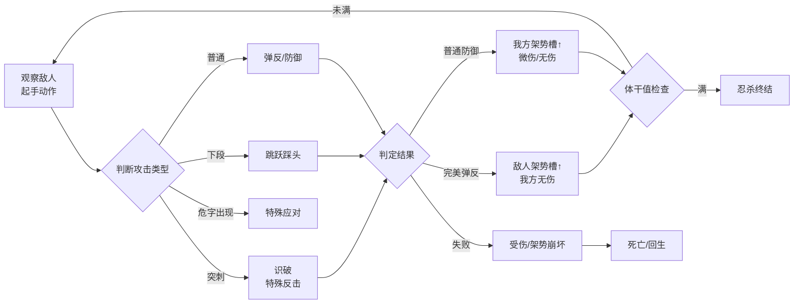

# 只狼：战斗手感、死亡惩罚与叙事沉浸的系统耦合

## 一、基本信息

| 项目 | 内容 |
|:-----|:-----|
| **游戏名称** | 只狼：影逝二度（Sekiro: Shadows Die Twice） |
| **开发商/发行商** | FromSoftware / Activision（全球）/ 方块游戏（国区代理） |
| **上线日期** | 2019-03-22 |
| **平台** | PC / PS4 / Xbox One（后续登陆PS5/XSX） |
| **底层驱动（主导）** | 操作心流型 |
| **底层驱动（次要）** | 内容叙事型 |
| **商业化模式** | 买断制（标准版268元 / 年度版398元） |
| **拆解版本** | 1.06 |
| **拆解日期** | [待填写] |

## 二、拆解侧重点说明

> 根据[[90-2-1-2 底层驱动分类图谱]]和[[90-2-1-3 拆解维度标准SOP]]的权重分配，本篇报告的分析重心如下：

| 维度 | 权重 | 说明 |
|:-----|:----:|:-----|
| 第1层：核心循环（分钟级） | ★★★★★ | 拼刀系统是只狼的“心脏”——攻防转换节奏、弹反判定帧、架势槽机制构成核心体验的全部 |
| 第2层：成长循环（天/周级） | ★★★ | 佛雕师升级、技能树、忍义手强化构成中长线目标，但非核心驱动力 |
| 第3层：商业化设计 | ★ | 买断制，无内购，分析集中在“定价策略”和“年度版/DLC” |
| 第4层：社交结构 | ☆ | 纯单机游戏，无社交系统，仅残留异步留言系统（非核心） |
| 第5层：长线留存机制 | ★★★ | 多结局、二周目（New Game+）、Boss挑战的“重玩性”设计 |
| 第6层：美术/UI/信息传达 | ★★★★ | 极简UI、视觉引导、受击反馈的“去UI化”信息传达——这是操作心流型游戏的典范 |

> **系统视角声明**：本报告采用系统视角，不将游戏的成功或失败归因于单一因素，而是试图描述各要素之间的协同、耦合与相互强化关系。各章节的分析结论将在“第十一章 系统因果分析”中整合为完整的因果网络图。

## 三、第1层：核心循环（分钟级）

> **定义**：玩家在游戏中最基本的“操作-反馈-决策”单元。参考[[90-2-1-3 拆解维度标准SOP#1.3 第1层：核心循环]]。

### 3.1 最小循环描述

只狼的核心循环可以拆解为“攻防回合”——敌我双方在数秒内完成“攻击→防御/弹反→反击→新的攻防回合”的循环。每一次“刀剑相交”是一个微循环，时长约0.5-2秒。

完整战斗链条：

