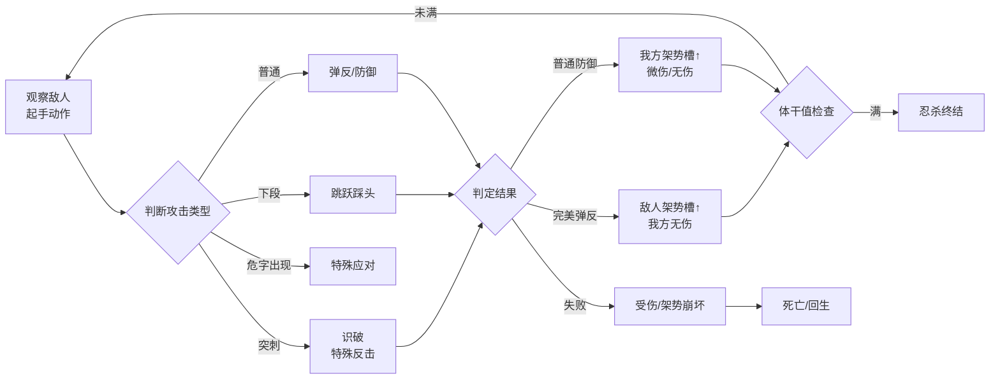

# 只狼：战斗手感、死亡惩罚与叙事沉浸的系统耦合

## 一、基本信息

| 项目 | 内容 |
|:-----|:-----|
| **游戏名称** | 只狼：影逝二度（Sekiro: Shadows Die Twice） |
| **开发商/发行商** | FromSoftware / Activision（全球）/ 方块游戏（国区代理） |
| **上线日期** | 2019-03-22 |
| **平台** | PC / PS4 / Xbox One（后续登陆PS5/XSX） |
| **底层驱动（主导）** | 操作心流型 |
| **底层驱动（次要）** | 内容叙事型 |
| **商业化模式** | 买断制（标准版268元 / 年度版398元） |
| **拆解版本** | 1.06 |
| **拆解日期** | [待填写] |

## 二、拆解侧重点说明

> 根据[[90-2-1-2 底层驱动分类图谱]]和[[90-2-1-3 拆解维度标准SOP]]的权重分配，本篇报告的分析重心如下：

| 维度 | 权重 | 说明 |
|:-----|:----:|:-----|
| 第1层：核心循环（分钟级） | ★★★★★ | 拼刀系统是只狼的“心脏”——攻防转换节奏、弹反判定帧、架势槽机制构成核心体验的全部 |
| 第2层：成长循环（天/周级） | ★★★ | 佛雕师升级、技能树、忍义手强化构成中长线目标，但非核心驱动力 |
| 第3层：商业化设计 | ★ | 买断制，无内购，分析集中在“定价策略”和“年度版/DLC” |
| 第4层：社交结构 | ☆ | 纯单机游戏，无社交系统，仅残留异步留言系统（非核心） |
| 第5层：长线留存机制 | ★★★ | 多结局、二周目（New Game+）、Boss挑战的“重玩性”设计 |
| 第6层：美术/UI/信息传达 | ★★★★ | 极简UI、视觉引导、受击反馈的“去UI化”信息传达——这是操作心流型游戏的典范 |

> **系统视角声明**：本报告采用系统视角，不将游戏的成功或失败归因于单一因素，而是试图描述各要素之间的协同、耦合与相互强化关系。各章节的分析结论将在“第十一章 系统因果分析”中整合为完整的因果网络图。

## 三、第1层：核心循环（分钟级）

> **定义**：玩家在游戏中最基本的“操作-反馈-决策”单元。参考[[90-2-1-3 拆解维度标准SOP#1.3 第1层：核心循环]]。

### 3.1 最小循环描述

只狼的核心循环可以拆解为“攻防回合”——敌我双方在数秒内完成“攻击→防御/弹反→反击→新的攻防回合”的循环。每一次“刀剑相交”是一个微循环，时长约0.5-2秒。

完整战斗链条：

### 3.3 关键参数

|参数|数值|说明|
|---|---|---|
|单次循环时长|0.5-2秒|单次攻防交换的持续时间|
|完美弹反判定窗口|约0.2秒（30帧@60fps）|核心手感来源——严格但不苛刻|
|普通防御判定窗口|约0.5秒|容错率高但代价是架势槽上涨|
|循环中的决策点数量|3-4个|判断攻击类型 + 选择应对方式 + 位置控制 + 时机控制|
|随机元素占比|极低|敌人的攻击模式有随机性（选择哪一套出招），但无数值随机（暴击/未命中）|

### 3.4 爽感来源分析

只狼的爽感来自“刀剑相交的节奏共鸣”——这是动作游戏史上最接近“剑戟片”手感的系统设计。

具体触发点：

1. **连续完美弹反的“打铁声”**：连续的“叮-叮-叮”音效叠加，形成音乐般的节奏感，配合火花特效，产生类似音游的“踩点快感”
    
2. **体干值满后的“忍杀”**：经过多轮攻防积累的架势槽被一次性“兑现”为斩杀动画——延迟满足的最优解
    
3. **识破突刺的“踩刀”**：对“危”字攻击的成功应对，产生“我读懂了敌人”的智力快感
    

### 3.5 潜在疲劳点

1. **学习曲线的“摔墙期”**：初期玩家尚未掌握弹反节奏时，每个Boss都是“毫无还手之力”的体验——这种“不公平感”会导致第一批玩家流失
    
2. **重复挑战的“肌肉疲劳”**：连续挑战同一Boss超过20次后，玩家的注意力会下降，操作精度衰减，进入“越打越差”的负向循环
    
3. **无精力条设计**：相比《黑暗之魂》的精力管理，只狼的“无限攻击”鼓励进攻，但也让战斗节奏过于紧绷——缺乏“喘息”的间隙
    

### 3.6 ← → 与其他层的交互

|关联层|交互关系|
|---|---|
|第2层（成长循环）|击败Boss获得的“战斗记忆”用于提升攻击力——核心循环的成就（击败强敌）直接转化为数值成长，而数值成长又让后续战斗的容错率提升|
|第3层（商业化）|买断制意味着核心循环的完整性不受付费干扰——所有玩家体验到的“手感”是同一套标准|
|第4层（社交结构）|单机游戏无社交，但“Boss战难度”本身成为玩家社区讨论的核心素材——社区中的“攻略/逃课打法”构成了异步的“社交”|
|第5层（长线留存）|核心循环的深度（完美弹反的精进空间）为多周目挑战提供了“技术验证”的动机——“我能无伤过苇名一心吗？”|
|第6层（UI/信息）|核心循环中的“危”字提示是“去UI化”信息传达的典范——它不是血条旁的文字提示，而是直接浮现在敌人头顶/武器上的视觉警告|

## 四、第2层：成长循环（天/周级）

> **定义**：玩家在每日/每周时间尺度上的行为模式。参考[[90-2-1-3 拆解维度标准SOP#1.4 第2层：成长循环]]。

### 4.1 每日必做（Daily）

> 只狼为纯单机线性/半开放游戏，无“每日必做”概念，以“游戏进度”而非“真实时间”驱动。

|行为|耗时|奖励|驱动力类型|
|---|---|---|---|
|探索新区域|30-120分钟|新道具/新路线/新Boss|内容|
|挑战当前Boss|5-30分钟/次|战斗记忆（攻击力）/ 关键道具|内容+数值|
|刷经验/金钱|10-30分钟|技能点 / 金钱|数值|
|寻找佛雕师升级|10-20分钟|忍义手新技能|数值|

### 4.2 每周目标（Weekly）

> 无“每周重置”概念，以“阶段性目标”为单位（如“击败弦一郎”“到达源之宫”）。

|目标|重置周期|奖励|是否强制|
|---|---|---|---|
|击败当前区域Boss|一次性|关键道具/新区域解锁|是（剧情推进）|
|收集散落佛珠|一次性|体力上限提升|否（但提升生存能力）|
|寻找战斗记忆|一次性|攻击力提升|是（核心数值成长）|

### 4.3 资源循环图

text

[探索 / 击败敌人] → [经验值 / 金钱] → [技能点 / 购买道具]
                              ↓
[击败Boss] → [战斗记忆] → [攻击力提升] → [解锁新Boss]
                              ↓
[收集佛珠] → [体力上限提升] → [容错率提升] → [解锁高难度挑战]

文字说明：  
只狼的成长系统是“线性锁链”结构——大部分关键成长节点（攻击力/体力上限）被绑定在Boss击杀上。Boss是门锁，击败Boss是钥匙，新区域/新能力是被打开的门。这种设计确保了“玩家当前的数值/能力与游戏难度保持同步”——不存在“刷小怪刷到满级碾压Boss”的逃课空间。

### 4.4 断档期识别

- “卡关”状态：当前Boss始终打不过，且地图上已无可探索区域 → 玩家陷入“只有一条路但走不通”的困境
    
- 解决方法：游戏设计了“鬼佛（传送点）之间的快速移动”和“分支路线”，部分Boss可暂时绕过
    

### 4.5 长线目标

|时间维度|核心目标|进度可视化方式|
|---|---|---|
|1周|通关主线（约15-20小时）|区域解锁进度 + Boss击杀数|
|2-4周|全Boss击杀（含隐藏Boss）|成就列表|
|1-3个月|多结局通关（4种结局）|结局成就|
|长期|无伤Boss挑战 / 速通 / 1级挑战|社区记录（非游戏内）|

### 4.6 ← → 与其他层的交互

|关联层|交互关系|
|---|---|
|第1层（核心循环）|成长系统的核心设计原则是“不破坏核心循环”——攻击力提升让Boss战时长缩短（容错率提升），但不改变“弹反-忍杀”的基本玩法框架|
|第3层（商业化）|买断制下成长系统不存在“付费加速”，保证了所有玩家体验到的“难度曲线”一致|
|第4层（社交结构）|成长路径的“刚性”（必须击败Boss）创造了社区中“攻略分享”和“逃课打法”的UGC生态|
|第5层（长线留存）|多结局需要多周目通关——二周目不仅继承数值，Boss的体干值/血量也会提升，形成“难度匹配”的再挑战体验|

## 五、第3层：商业化设计

> **定义**：游戏如何将玩家体验转化为收入。参考[[90-2-1-3 拆解维度标准SOP#1.5 第3层：商业化设计]]。

### 5.1 付费入口总览

|付费类型|付费形式|对应心理账户|价格区间|
|---|---|---|---|
|游戏本体|一次性买断|“购买一款必玩之作”|268元（标准版）|
|年度版/GOTY版|一次性买断|“全套体验”|398元（含DLC）|

### 5.2 核心付费路径

玩家在购买前可能经历：口碑/直播/评测认知 → 确认“这是适合我的难度” → 支付买断费用 → 下载游戏 → 开始体验。不存在购买后的“二次付费”。

### 5.3 付费深度分析

|维度|数据|说明|
|---|---|---|
|零氪vs满氪战力差距|无差距|买断制下所有玩家体验一致|
|全DLC/全内容花费|398元（年度版）|仅有一个付费DLC（Boss Rush模式）|
|是否有付费上限|是|本体+DLC一次性付费|

### 5.4 付费与体验的关系

买断制意味着“体验完整度”和“付费金额”之间的强绑定——你付一次钱，获得完整的100%内容。游戏内无任何额外付费入口，玩家的注意力完全集中在“如何通关”而非“需不需要再花钱”。

### 5.5 诱导性设计识别

|设计手法|是否存在|具体表现|
|---|---|---|
|首充双倍/限时优惠|❌|无内购概念|
|概率展示（保底/随机）|❌|无抽卡|
|限时卡池/限定皮肤|❌|无内购|
|沉没成本诱导|❌|买断制不产生“已经充了钱必须继续玩”的持续压力|
|社交展示（付费身份的可见性）|❌|无内购展示|

### 5.6 ← → 与其他层的交互

|关联层|交互关系|
|---|---|
|第1层（核心循环）|买断制保障了核心循环的“纯净性”——游戏设计的目标是“提供最佳体验”而非“引导付费”|
|第2层（成长循环）|无付费加速，成长速度完全由玩家技术决定，不受付费差异影响|
|第4层（社交结构）|无付费身份分层，社区中受尊重的是“技术好”而非“氪金多”|
|第5层（长线留存）|无持续付费压力，玩家留存的动机纯粹来自“想玩”而非“已经付了钱不想亏”|

## 六、第4层：社交结构

> **定义**：游戏如何组织和定义玩家之间的关系。参考[[90-2-1-3 拆解维度标准SOP#1.6 第4层：社交结构]]。

### 6.1 社交层级图

只狼为纯单机游戏，无内置社交系统。唯一的“弱社交”元素是：

- 异步留言系统（残影）：玩家可在地上留下信息（“前面有危险”“跳下去”等），其他玩家可见
    
- 但这**不构成真正的社交互动**——无ID关联、无回复/点赞机制
