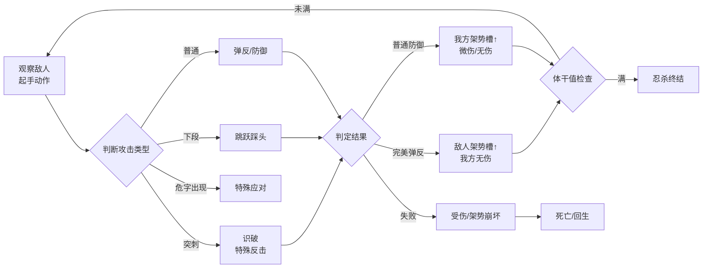
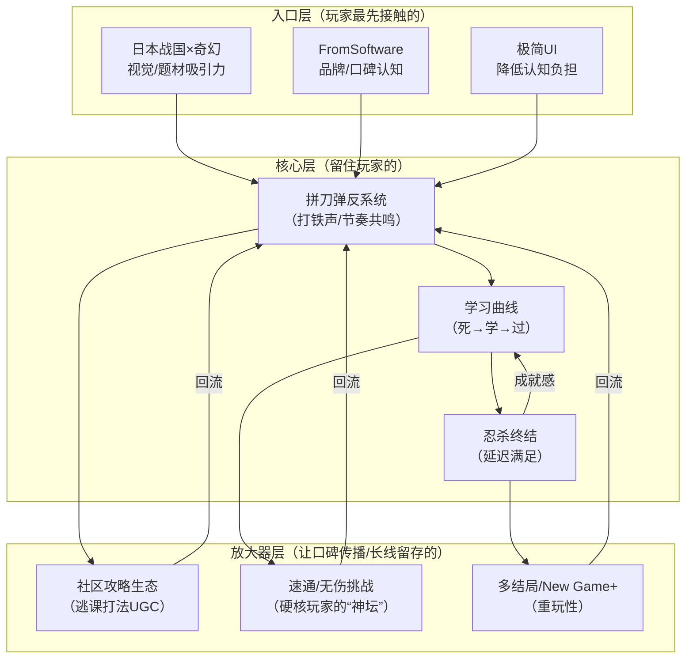

## 一、基本信息

| 项目           | 内容                                        |
| :----------- | :---------------------------------------- |
| **游戏名称**     | 只狼：影逝二度（Sekiro: Shadows Die Twice）        |
| **开发商/发行商**  | FromSoftware / Activision（全球）/ 方块游戏（国区代理） |
| **上线日期**     | 2019-03-22                                |
| **平台**       | PC / PS4 / Xbox One（后续登陆PS5/XSX）          |
| **底层驱动（主导）** | 操作心流型                                     |
| **底层驱动（次要）** | 内容叙事型                                     |
| **商业化模式**    | 买断制（标准版268元 / 年度版398元）                    |
| **拆解版本**     | 1.06                                      |

## 二、拆解侧重点说明

> 根据[[90-2-1-2 底层驱动分类图谱]]和[[90-2-1-3 拆解维度标准SOP]]的权重分配，本篇报告的分析重心如下：

| 维度 | 权重 | 说明 |
|:-----|:----:|:-----|
| 第1层：核心循环（分钟级） | ★★★★★ | 拼刀系统是只狼的“心脏”——攻防转换节奏、弹反判定帧、架势槽机制构成核心体验的全部 |
| 第2层：成长循环（天/周级） | ★★★ | 佛雕师升级、技能树、忍义手强化构成中长线目标，但非核心驱动力 |
| 第3层：商业化设计 | ★ | 买断制，无内购，分析集中在“定价策略”和“年度版/DLC” |
| 第4层：社交结构 | ☆ | 纯单机游戏，无社交系统，仅残留异步留言系统（非核心） |
| 第5层：长线留存机制 | ★★★ | 多结局、二周目（New Game+）、Boss挑战的“重玩性”设计 |
| 第6层：美术/UI/信息传达 | ★★★★ | 极简UI、视觉引导、受击反馈的“去UI化”信息传达——这是操作心流型游戏的典范 |

> **系统视角声明**：本报告采用系统视角，不将游戏的成功或失败归因于单一因素，而是试图描述各要素之间的协同、耦合与相互强化关系。各章节的分析结论将在“第十一章 系统因果分析”中整合为完整的因果网络图。

## 三、第1层：核心循环（分钟级）

> **定义**：玩家在游戏中最基本的“操作-反馈-决策”单元。参考[[90-2-1-3 拆解维度标准SOP#1.3 第1层：核心循环]]。

### 3.1 最小循环描述

只狼的核心循环可以拆解为“攻防回合”——敌我双方在数秒内完成“攻击→防御/弹反→反击→新的攻防回合”的循环。每一次“刀剑相交”是一个微循环，时长约0.5-2秒。

完整战斗链条：

### 3.3 关键参数

|参数|数值|说明|
|---|---|---|
|单次循环时长|0.5-2秒|单次攻防交换的持续时间|
|完美弹反判定窗口|约0.2秒（30帧@60fps）|核心手感来源——严格但不苛刻|
|普通防御判定窗口|约0.5秒|容错率高但代价是架势槽上涨|
|循环中的决策点数量|3-4个|判断攻击类型 + 选择应对方式 + 位置控制 + 时机控制|
|随机元素占比|极低|敌人的攻击模式有随机性（选择哪一套出招），但无数值随机（暴击/未命中）|

### 3.4 爽感来源分析

只狼的爽感来自“刀剑相交的节奏共鸣”——这是动作游戏史上最接近“剑戟片”手感的系统设计。

具体触发点：

1. **连续完美弹反的“打铁声”**：连续的“叮-叮-叮”音效叠加，形成音乐般的节奏感，配合火花特效，产生类似音游的“踩点快感”
    
2. **体干值满后的“忍杀”**：经过多轮攻防积累的架势槽被一次性“兑现”为斩杀动画——延迟满足的最优解
    
3. **识破突刺的“踩刀”**：对“危”字攻击的成功应对，产生“我读懂了敌人”的智力快感
    

### 3.5 潜在疲劳点

1. **学习曲线的“摔墙期”**：初期玩家尚未掌握弹反节奏时，每个Boss都是“毫无还手之力”的体验——这种“不公平感”会导致第一批玩家流失
    
2. **重复挑战的“肌肉疲劳”**：连续挑战同一Boss超过20次后，玩家的注意力会下降，操作精度衰减，进入“越打越差”的负向循环
    
3. **无精力条设计**：相比《黑暗之魂》的精力管理，只狼的“无限攻击”鼓励进攻，但也让战斗节奏过于紧绷——缺乏“喘息”的间隙
    

### 3.6 ← → 与其他层的交互

|关联层|交互关系|
|---|---|
|第2层（成长循环）|击败Boss获得的“战斗记忆”用于提升攻击力——核心循环的成就（击败强敌）直接转化为数值成长，而数值成长又让后续战斗的容错率提升|
|第3层（商业化）|买断制意味着核心循环的完整性不受付费干扰——所有玩家体验到的“手感”是同一套标准|
|第4层（社交结构）|单机游戏无社交，但“Boss战难度”本身成为玩家社区讨论的核心素材——社区中的“攻略/逃课打法”构成了异步的“社交”|
|第5层（长线留存）|核心循环的深度（完美弹反的精进空间）为多周目挑战提供了“技术验证”的动机——“我能无伤过苇名一心吗？”|
|第6层（UI/信息）|核心循环中的“危”字提示是“去UI化”信息传达的典范——它不是血条旁的文字提示，而是直接浮现在敌人头顶/武器上的视觉警告|

## 四、第2层：成长循环（天/周级）

> **定义**：玩家在每日/每周时间尺度上的行为模式。参考[[90-2-1-3 拆解维度标准SOP#1.4 第2层：成长循环]]。

### 4.1 每日必做（Daily）

> 只狼为纯单机线性/半开放游戏，无“每日必做”概念，以“游戏进度”而非“真实时间”驱动。

|行为|耗时|奖励|驱动力类型|
|---|---|---|---|
|探索新区域|30-120分钟|新道具/新路线/新Boss|内容|
|挑战当前Boss|5-30分钟/次|战斗记忆（攻击力）/ 关键道具|内容+数值|
|刷经验/金钱|10-30分钟|技能点 / 金钱|数值|
|寻找佛雕师升级|10-20分钟|忍义手新技能|数值|

### 4.2 每周目标（Weekly）

> 无“每周重置”概念，以“阶段性目标”为单位（如“击败弦一郎”“到达源之宫”）。

|目标|重置周期|奖励|是否强制|
|---|---|---|---|
|击败当前区域Boss|一次性|关键道具/新区域解锁|是（剧情推进）|
|收集散落佛珠|一次性|体力上限提升|否（但提升生存能力）|
|寻找战斗记忆|一次性|攻击力提升|是（核心数值成长）|

### 4.3 资源循环图

text

[探索 / 击败敌人] → [经验值 / 金钱] → [技能点 / 购买道具]
                              ↓
[击败Boss] → [战斗记忆] → [攻击力提升] → [解锁新Boss]
                              ↓
[收集佛珠] → [体力上限提升] → [容错率提升] → [解锁高难度挑战]

文字说明：  
只狼的成长系统是“线性锁链”结构——大部分关键成长节点（攻击力/体力上限）被绑定在Boss击杀上。Boss是门锁，击败Boss是钥匙，新区域/新能力是被打开的门。这种设计确保了“玩家当前的数值/能力与游戏难度保持同步”——不存在“刷小怪刷到满级碾压Boss”的逃课空间。

### 4.4 断档期识别

- “卡关”状态：当前Boss始终打不过，且地图上已无可探索区域 → 玩家陷入“只有一条路但走不通”的困境
    
- 解决方法：游戏设计了“鬼佛（传送点）之间的快速移动”和“分支路线”，部分Boss可暂时绕过
    

### 4.5 长线目标

|时间维度|核心目标|进度可视化方式|
|---|---|---|
|1周|通关主线（约15-20小时）|区域解锁进度 + Boss击杀数|
|2-4周|全Boss击杀（含隐藏Boss）|成就列表|
|1-3个月|多结局通关（4种结局）|结局成就|
|长期|无伤Boss挑战 / 速通 / 1级挑战|社区记录（非游戏内）|

### 4.6 ← → 与其他层的交互

|关联层|交互关系|
|---|---|
|第1层（核心循环）|成长系统的核心设计原则是“不破坏核心循环”——攻击力提升让Boss战时长缩短（容错率提升），但不改变“弹反-忍杀”的基本玩法框架|
|第3层（商业化）|买断制下成长系统不存在“付费加速”，保证了所有玩家体验到的“难度曲线”一致|
|第4层（社交结构）|成长路径的“刚性”（必须击败Boss）创造了社区中“攻略分享”和“逃课打法”的UGC生态|
|第5层（长线留存）|多结局需要多周目通关——二周目不仅继承数值，Boss的体干值/血量也会提升，形成“难度匹配”的再挑战体验|

## 五、第3层：商业化设计

> **定义**：游戏如何将玩家体验转化为收入。参考[[90-2-1-3 拆解维度标准SOP#1.5 第3层：商业化设计]]。

### 5.1 付费入口总览

|付费类型|付费形式|对应心理账户|价格区间|
|---|---|---|---|
|游戏本体|一次性买断|“购买一款必玩之作”|268元（标准版）|
|年度版/GOTY版|一次性买断|“全套体验”|398元（含DLC）|

### 5.2 核心付费路径

玩家在购买前可能经历：口碑/直播/评测认知 → 确认“这是适合我的难度” → 支付买断费用 → 下载游戏 → 开始体验。不存在购买后的“二次付费”。

### 5.3 付费深度分析

|维度|数据|说明|
|---|---|---|
|零氪vs满氪战力差距|无差距|买断制下所有玩家体验一致|
|全DLC/全内容花费|398元（年度版）|仅有一个付费DLC（Boss Rush模式）|
|是否有付费上限|是|本体+DLC一次性付费|

### 5.4 付费与体验的关系

买断制意味着“体验完整度”和“付费金额”之间的强绑定——你付一次钱，获得完整的100%内容。游戏内无任何额外付费入口，玩家的注意力完全集中在“如何通关”而非“需不需要再花钱”。

### 5.5 诱导性设计识别

|设计手法|是否存在|具体表现|
|---|---|---|
|首充双倍/限时优惠|❌|无内购概念|
|概率展示（保底/随机）|❌|无抽卡|
|限时卡池/限定皮肤|❌|无内购|
|沉没成本诱导|❌|买断制不产生“已经充了钱必须继续玩”的持续压力|
|社交展示（付费身份的可见性）|❌|无内购展示|

### 5.6 ← → 与其他层的交互

|关联层|交互关系|
|---|---|
|第1层（核心循环）|买断制保障了核心循环的“纯净性”——游戏设计的目标是“提供最佳体验”而非“引导付费”|
|第2层（成长循环）|无付费加速，成长速度完全由玩家技术决定，不受付费差异影响|
|第4层（社交结构）|无付费身份分层，社区中受尊重的是“技术好”而非“氪金多”|
|第5层（长线留存）|无持续付费压力，玩家留存的动机纯粹来自“想玩”而非“已经付了钱不想亏”|

## 六、第4层：社交结构

> **定义**：游戏如何组织和定义玩家之间的关系。参考[[90-2-1-3 拆解维度标准SOP#1.6 第4层：社交结构]]。

### 6.1 社交层级图

只狼为纯单机游戏，无内置社交系统。唯一的“弱社交”元素是：

- 异步留言系统（残影）：玩家可在地上留下信息（“前面有危险”“跳下去”等），其他玩家可见
    
- 但这**不构成真正的社交互动**——无ID关联、无回复/点赞机制

### 6.2 社交驱动力分析

|社交形式|是否强制|核心驱动力|回报类型|
|---|---|---|---|
|好友/关注|❌ 不存在|—|—|
|组队/联机|❌ 不存在|—|—|
|公会/帮派|❌ 不存在|—|—|
|阵营/势力|❌ 不存在|—|—|

### 6.3 社交身份的可见性

不适用（无社交系统）。

### 6.4 负面社交处理

不适用（无社交系统）。

### 6.5 ← → 与其他层的交互

|关联层|交互关系|
|---|---|
|第1层（核心循环）|无社交系统，核心循环的体验完全“内向”——玩家面对的只有自己和Boss，没有任何“被别人看到”的压力或激励|
|第2层（成长循环）|成长路径无需依赖他人，玩家的成就感纯粹来自“自我突破”而非“比较”|
|第3层（商业化）|无社交展示型付费内容|
|第5层（长线留存）|无社交退出成本，留存完全依赖“自我挑战”动机|

## 七、第5层：长线留存机制

> **定义**：游戏如何让玩家在“通关之后”仍然愿意回到游戏中。参考[[90-2-1-3 拆解维度标准SOP#1.7 第5层：长线留存机制]]。

### 7.1 内容更新节奏

|更新类型|频率|内容量|预告周期|
|---|---|---|---|
|免费更新（Boss挑战模式）|一次性（2020年10月）|Boss Rush（Boss连战）+ 新服装|无长期预告|
|DLC（年度版内容）|一次性|同上|—|

只狼作为单机游戏，不存在长期持续更新。

### 7.2 通关后（第30天 vs 第180天）的留存驱动力

|时间节点|核心驱动力|玩家状态|
|---|---|---|
|第30天（通关后）|多结局体验、隐藏Boss挑战、收集全佛珠|仍有未完成的内容目标|
|第180天|无伤挑战、速通尝试、Mod安装|进入“为爱发电”的硬核玩家阶段|

### 7.3 回归机制

|机制|描述|效果评估|
|---|---|---|
|多结局（4种）|每个结局需要不同的关键选择/道具|中等——驱动1-2次重玩|
|New Game+|继承数值但敌人变强|中等——继续挑战高难度|
|Boss挑战模式|限时连战Boss|低——仅硬核玩家|
|免费更新|2020年10月新增内容|短暂拉动回流|

### 7.4 退出成本分析

只狼的退出成本几乎为零——玩家在通关后没有任何“舍不得”（无社交契约、无持续付费、无账号绑定）。玩家留存的唯一原因就是“还想再打一遍”。

这正是单机买断制游戏的典型特征：**留存=纯自愿，离开=无负担**。

### 7.5 终局内容

- 四结局达成（需至少2-3周目）
    
- 全Boss击杀（含隐藏Boss“怨恨之鬼”“苇名一心”）
    
- 全忍义手升级（需要大量材料收集）
    
- 全技能解锁（需要大量刷经验）
    
- 无伤/速通/1级挑战（纯社区驱动）
    

### 7.6 ← → 与其他层的交互

|关联层|交互关系|
|---|---|
|第1层（核心循环）|核心循环的“深度”（弹反帧的精进空间）是长线留存的根本——如果一个游戏的操作没有“精进”空间，多周目就只是“重复劳动”|
|第2层（成长循环）|New Game+让成长曲线重新激活——Boss更强、容错率更低，玩家的数值成长和Boss难度的“竞速”成为二周目驱动力|
|第3层（商业化）|买断制下不存在“持续付费”的留存压力，留存仅靠内容和玩法本身|
|第4层（社交结构）|社区中的“速通排行榜”“无伤集锦”创造了外部留存动力——玩家为了“被社区认可”而持续挑战|

## 八、第6层：美术/UI/信息传达

> **定义**：视觉和界面设计如何服务于“让玩家看懂、融入、不疲倦”。参考[[90-2-1-3 拆解维度标准SOP#1.8 第6层：美术/UI/信息传达]]。

### 8.1 审美调性分析

|维度|描述|是否服务于核心体验|
|---|---|---|
|整体美术风格|日本战国×奇幻，水墨质感，冷色调为主|是——强化了“孤独忍者”的世界观|
|色彩倾向|整体偏灰绿/灰蓝，饱和度低，强调“雾”和“光影”|是——营造萧瑟的末日感|
|角色设计语言|敌人设计突出“压迫感”（如苇名一心的盔甲、怨恨之鬼的体型），主角设计突出“敏捷”（细长的刀、轻便装束）|是——视觉信息辅助战斗判断|
|场景/环境风格|半开放“箱庭”结构，路径清晰但有探索空间|是——区域间的“地标”辅助空间记忆|
|UI视觉风格|极简主义——血量槽×2（体力+架势）、道具栏、无小地图|是——“去UI化”让玩家注意力完全集中在战斗本身|

### 8.2 UI效率分析

|常用操作|操作步骤数|是否合理|
|---|---|---|
|切换道具|1步（方向键上下）|是|
|切换忍义手|1步（方向键左右）|是|
|使用道具|1步（按键）|是|
|查看状态/技能|2步（菜单+选择）|是|

### 8.3 信息传达效率分析

|信息类型|传达方式|响应速度|是否清晰|
|---|---|---|---|
|血量/架势状态|屏幕左下角两个长条|即时|是|
|敌人架势状态|敌人血条下方的长条（有且仅有）|即时|是|
|攻击预警（“危”字）|屏幕中央大红字 + 敌人武器闪烁|0.1秒|是——这是只狼UI设计的“神来之笔”|
|战斗反馈（弹反/受击）|音效（打铁声/刀砍肉声）+ 火花/血液特效|即时|是|
|任务/目标提示|几乎无——仅通过NPC对话和“鬼佛”指引|无实时提示|玩家需要自己记住“要去哪”|

### 8.4 优秀设计与可改进点

**优秀设计（≥3处）**：

1. **“危”字预警系统**：大红色浮在屏幕中央，不遮挡战斗视野，配合三种攻击类型（突刺/下段/普通）的敌人动作差异，用“一个字”完成了信息压缩
    
2. **无小地图设计**：强制玩家通过视觉记忆场景布局，强化“沉浸”而非“跟随导航”的体验
    
3. **极简HUD**：只有必要的血量/架势/道具信息，战斗时屏幕保持“干净”，玩家的注意力100%在敌人身上
    
4. **弹反的特效/音效组合**：“叮”声+大火花=完美弹反，“铛”声+小火花=普通防御，声音的频率和音色差异让人耳不自觉地分辨
    

**可改进点（≥3处）**：

1. **目标提示过于模糊**：部分关键路径缺乏视觉引导，玩家容易迷路或在“不知道下一步去哪”的状态中浪费大量时间
    
2. **Boss战的“死亡→跑尸”路径冗长**：某些Boss（如苇名弦一郎）的复活点离竞技场过远，增加了不必要的挫败感
    
3. **新手引导不足**：游戏未清晰说明“弹反”“识破”“跳跃踩头”的核心机制，大量玩家在初期靠“瞎按”摸索
    

### 8.5 ← → 与其他层的交互

|关联层|交互关系|
|---|---|
|第1层（核心循环）|“危”字预警系统是核心循环中“判断攻击类型”的信息输入——它的响应速度和清晰度决定了玩家能否做出正确的应对决策|
|第2层（成长循环）|无小地图设计让“探索”本身成为成长循环的一部分——发现新鬼佛=解锁新传送点=解锁新区域=新的成长目标|
|第3层（商业化）|极简UI是“买断制”的设计哲学延展——不需要在UI中嵌入商店入口、首充提示、活动入口等干扰信息|
|第4层（社交结构）|无小地图和不明确的任务目标创造了“攻略依赖”——玩家不得不在社区中搜索地图和路线指引，间接促进了外部社区的形成|

## 九、弃坑拐点分析

|阶段|典型流失原因|机制层面是否存在预防设计|
|---|---|---|
|新手期（前1-3小时）|未理解弹反/识破机制，在第一个精英怪“组长山内重则”处反复死亡|游戏提供了“不死半兵卫”的训练功能，但未强制玩家学习；大部分玩家会选择硬抗而非训练|
|成长期（中期Boss）|遇到“苇名弦一郎”等初具难度的Boss，无法突破，且地图上已无可探索区域|存在分支路线可绕过（如先探索仙峰寺/坠落之谷），但部分玩家不知情|
|成熟期（后期Boss）|“怨恨之鬼”“苇名一心”等终局Boss的难度陡然上升，导致“就差最后一步但放弃”|无难度调节机制——Boss就是那个强度，打不过就永远卡住|
|通关后（长线期）|内容耗尽，无新挑战|New Game+、Boss挑战模式、多结局提供了有限的重玩性|

## 十、横向穿刺锚点

|锚点|本游戏数据|关联专题|
|---|---|---|
|核心循环时长|0.5-2秒（单次攻防）||
|每日必做耗时|无“每日”概念||
|首充金额/回报率|买断制，无首充||
|月卡/通行证价格与回报|买断制||
|单角色毕业期望花费|268元（本体）||
|零氪与满氪战力差距|无差距||
|公会人数上限|不适用|[[90-2-1-21 专题_社交结构金字塔]]|
|大版本更新周期|无长期更新|[[90-2-1-22 专题_赛季制与版本更新节奏研究]]|
|回归奖励规模|无||
|通关后留存驱动力|多结局/二周目/挑战|[[90-2-1-20 专题_DAU曲线与弃坑拐点分析]]|

## 十一、系统因果分析

**图例说明**：

- **入口层**：玩家通过什么进入游戏/被吸引
    
- **核心层**：玩家为什么持续玩下去
    
- **放大器层**：玩家为什么带朋友来、为什么回流
    
- **实线箭头**：直接因果/支撑关系
    
- **虚线箭头**：反馈强化关系

### 11.2 入口/核心/放大器分层说明

|层级|包含要素|作用|
|---|---|---|
|**入口层**|题材吸引力、FromSoftware品牌认知、极简UI|降低初次体验的“看不懂”焦虑，吸引玩家尝试|
|**核心层**|拼刀弹反系统、学习曲线、忍杀终结|创造“死→学→过”的成长快感，形成心流体验|
|**放大器层**|社区攻略生态、速通/无伤挑战、多结局|将“我通关了”升级为“我能在社区中站多高”，创造外部留存动力|

### 11.3 必要非充分说明

> **必填项**。明确声明单一因素不足以解释游戏的成功或失败。

**声明**：本报告认为，《只狼》的“年度游戏”级口碑是以下多因素共同作用的结果：FromSoftware的品牌信任、日本战国×奇幻的题材吸引力、完美弹反的精确手感设计、无精力条的激进战斗哲学、忍杀终结的延迟满足设计、“危”字预警的信息压缩艺术。其中：

- **拼刀弹反系统**是“好玩”的**必要非充分条件**——没有这套极致的“刀剑相交”手感，只狼只是一款普通的魂系游戏；但仅有弹反手感，没有敌人AI的精心设计、Boss战的节奏编排、以及“危”字信息的精准传达，这套系统也无法生效；
    
- **学习曲线（死→学→过）**是“沉浸”的**核心稳定器**——它将玩家的挫败感转化为学习动机，用“我变强了而非角色变强了”替代了传统的数值成长，是魂系游戏“反直觉但有效”的范式；
    
- **“危”字信息设计**是“理解”的**强化因子**——它用极低的认知成本传达了极复杂的攻击类型信息，让玩家在紧张的Boss战中依然能做出准确决策；
    
- **社区UGC生态**是“传播力”的**放大器**——“逃课打法”“无伤集锦”“速通记录”是只狼在发售3年后仍然活跃的内容燃料。
    

**单一归因警告**：任何将《只狼》的成功归结为单一因素的解释，在本报告的框架下均被视为不完整的分析。

### 11.4 系统脆弱性识别

|脆弱环节|后果|现实案例/假设场景|
|---|---|---|
|“危”字信息传达失效|玩家无法判断攻击类型→频繁受伤→挫败感积累→弃坑|新手玩家不理解“危”字三种攻击的差异时会陷入大量死亡|
|学习曲线的“临界点”过陡|玩家在Boss战中连续失败超过阈值（如>30次），进入“习得性无助”状态|“怨恨之鬼”被广泛认为是“设计过难”的Boss，部分玩家在此弃坑|
|无难度调节机制|无法为不同水平的玩家提供差异化体验，卡关即终点|无法像《控制》或《死亡搁浅》那样在菜单中降低难度|

### 11.5 正向循环 vs 恶性循环

**正向循环（增长飞轮）**：

> 弹反手感好 → “叮叮叮”的爽感 → 我愿意再试一次 → 击败Boss的成就感 → 社区分享“我过了！” → 社区讨论发酵 → 更多新玩家尝试 → 更多“我过了！”的分享

**恶性循环（衰退螺旋）**：

> 无法理解弹反节奏 → 反复死亡 → 挫败感积累 → 认为“这游戏不合理” → 弃坑 → 在社区发布负面评价 → 劝阻潜在玩家 → 口碑受损 → 销量/热度下降

## 十二、总结

### 12.1 一句话评价

《只狼》是一款将“减法做到极致”的动作游戏——它去掉了精力条、去掉了多人模式、去掉了UI冗余、去掉了难度选择，然后用一套“完美弹反”系统贯穿始终，让“刀剑相交的节奏”成为唯一且足够的多巴胺来源。

### 12.2 核心发现（3-5条）

1. **“减法的艺术”：去UI化信息传达**：只狼的UI设计证明了“少即是多”——用一枚大红色的“危”字替代了复杂的敌招提示系统，用音效的“叮/铛”差异替代了视觉伤害数字。这种信息压缩让玩家的注意力100%集中在敌人动作上，是操作心流型游戏的UI典范。
    
2. **“刀剑相交”的节奏共鸣**：只狼的弹反系统本质上是“可视化的节奏游戏”——敌人攻击的节奏决定了“拍子”，玩家的弹反输入是“踩拍子”，完美弹反的连续进行产生了一种“战斗舞蹈”的审美体验。这正是“心流”的最佳演绎。
    
3. **学习曲线的“归因正确性”**：魂系游戏最难被抄袭的部分不是“难度”本身，而是“死亡后的归因”——在只狼中，你死了，你知道“是因为我弹反晚了0.1秒”，而不是“因为随机暴击”或“因为对面数值比我高”。这种清晰的归因是“再试一次”动机的前提。
    
4. **无社交的“社交生态”悖论**：只狼没有内置社交系统，却催生了庞大的外部社区——因为“单机挑战”的成就是可比较的（速通时间、无伤Boss数、通关方式），玩家的“独狼”成就转化为了社区中的“社交货币”。
    

### 12.3 可借鉴的设计点

1. **“危”字信息压缩模型**：用“一个字+敌人动作的微差异”完成三种攻击类型的识别传达，成本极低、效果极好，是“信息传达效率”的教科书级案例
    
2. **“无难度选择”的设计勇气**：不为“照顾所有玩家”而削弱核心体验，信任“玩家能学会”——这需要游戏内部的学习引导机制足够清晰
    
3. **“战斗即叙事”的耦合方式**：剧情不是通过CG动画推进的，而是通过Boss战的体验“生长”出来的——击败弦一郎时，你感受到的“对方也是拼尽全力”是通过战斗手感而非台词告诉你的
    

### 12.4 需警惕的陷阱

1. **“高手向”的排他性**：只狼的高难度天然筛选了“愿意挑战”的玩家，但放弃了“轻度玩家”这个巨大市场——这对任何商业游戏团队来说都需要慎重权衡
    
2. **学习曲线的“悬崖式”增长**：从精英怪到第一个主Boss的难度跨越过大，缺乏“渐进式”的难度爬升，可能导致早期流失率偏高
    
3. **终局内容的“衰竭速度”**：单机买断制的“长线”有天然天花板——内容一旦耗尽，玩家就会离开。只狼通过多结局和New Game+延迟了这一天，但无法避免
    

## 十三、关联笔记

- [[90-2-1-1 拆解总索引_MOC]]
    
- [[90-2-1-2 底层驱动分类图谱]]
    
- [[90-2-1-3 拆解维度标准SOP]]
    
- [[90-2-1-9 英雄联盟_操作博弈、赛季运营与电竞生态的系统协同]]（同为操作心流型，对比“PVE操作心流”vs“PVP操作心流”）
    
- [[90-2-1-15 崩坏3_动作手感、角色养成与版本节奏的系统耦合]]（同为操作心流型，对比“单机买断”vs“手游服务型”的操作设计差异）
    
- [[90-2-1-20 专题_DAU曲线与弃坑拐点分析]]（单机买断制的留存曲线 vs 服务型游戏）