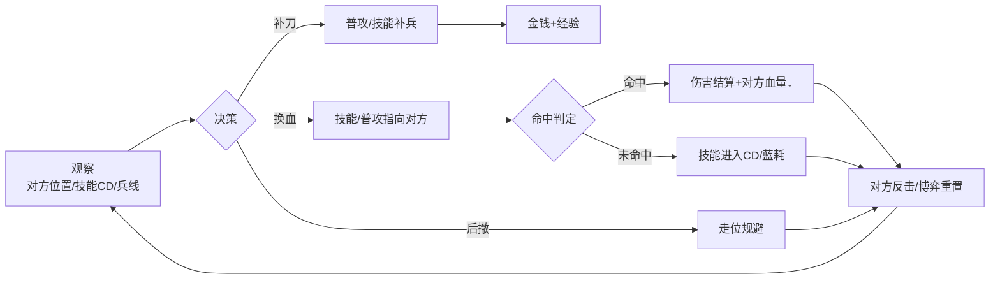
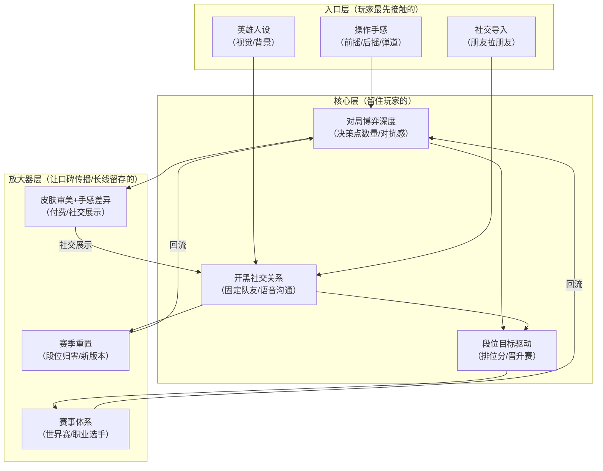

## 一、基本信息

| 项目 | 内容 |
|:-----|:-----|
| **游戏名称** | 英雄联盟（League of Legends） |
| **开发商/发行商** | Riot Games |
| **上线日期** | 2009-10-27（美服）/ 2011-09（国服） |
| **平台** | PC |
| **底层驱动（主导）** | 操作心流型 |
| **底层驱动（次要）** | 社交经济型 |
| **商业化模式** | 免费+内购（皮肤/英雄/通行证） |
| **拆解版本** | [待填写] |
| **拆解日期** | [待填写] |

## 二、拆解侧重点说明

> 根据[[90-2-1-2 底层驱动分类图谱]]和[[90-2-1-3 拆解维度标准SOP]]的权重分配，本篇报告的分析重心如下：

| 维度 | 权重 | 说明 |
|:-----|:----:|:-----|
| 第1层：核心循环（分钟级） | ★★★★★ | 对线期的“技能换血-走位-补刀”循环是玩家每时每刻体验的基础，技能前摇/后摇/弹道速度等参数决定手感 |
| 第2层：成长循环（天/周级） | ★★★★ | 排位赛的段位系统是每日/每周的核心驱动力，是“再打一局”最直接的动机 |
| 第3层：商业化设计 | ★★★★ | 皮肤是核心付费点，需分析皮肤定价策略、手感差异、通行证模型的经济学逻辑 |
| 第4层：社交结构 | ★★★★★ | 5v5的团队结构、开黑/单排的社交体验差异、俱乐部/战队生态 |
| 第5层：长线留存机制 | ★★★★ | 赛季重置、新英雄/新版本更新、世界赛作为内容锚点的运营逻辑 |
| 第6层：美术/UI/信息传达 | ★★★ | 技能特效的清晰度、受击反馈的视觉/音效设计、小地图信息密度控制 |

> **系统视角声明**：本报告采用系统视角，不将游戏的成功或失败归因于单一因素，而是试图描述各要素之间的协同、耦合与相互强化关系。各章节的分析结论将在“第十一章 系统因果分析”中整合为完整的因果网络图。

## 三、第1层：核心循环（分钟级）

> **定义**：玩家在游戏中最基本的“操作-反馈-决策”单元。参考[[90-2-1-3 拆解维度标准SOP#1.3 第1层：核心循环]]。

### 3.1 最小循环描述

英雄联盟的核心微循环为“观察→走位→技能/普攻→判定→反馈→新状态”。单次技能交换的微循环约0.3-2秒，取决于技能前摇、弹道速度和英雄间距。

以中单法师对线为例的完整链条：

### 3.3 关键参数

|参数|数值|说明|
|---|---|---|
|单次循环时长|0.3-2秒|技能释放+弹道飞行+反馈的完整链路|
|操作到反馈的延迟|约30-60ms（含网络补偿）|Riot的“延迟补偿”技术是手感的关键保障|
|循环中的决策点数量|3-5个|走位方向+技能选择+目标选择+召唤师技能+撤退/追击|
|随机元素占比|极低（仅暴击）|几乎全部确定性判定，暴击是唯一的数值随机|

### 3.4 爽感来源分析

英雄联盟的爽感来源是多层次的：

1. **技能命中的即时反馈**：技能命中时的音效（如“嘭”的打击声）、伤害数字的弹出、敌方血量的瞬间下降——形成了明确的正反馈信号
    
2. **连招的流畅执行**：一套完整连招（如劫的“R+W+E+Q+R”换位）的成功打出，产生“我操作拉满了”的掌控感
    
3. **团战的“大招时刻”**：一次完美的大招释放（如墨菲特的“势不可挡”撞起5人）改变了整个战局，产生了“英雄主义”的集体快感
    

### 3.5 潜在疲劳点

1. **对线期的“呼吸感”缺失**：高分段对线的每一秒都在进行走位博弈，精神高度紧绷。一局游戏持续30-45分钟，后半程注意力必然下降
    
2. **逆风局的“慢性死亡”**：当经济差大到无法逆转时，游戏进入“等待被推”阶段，玩家在15-20分钟里失去任何正反馈
    
3. **补刀的“重复性劳动”**：每局游戏的前10分钟，补刀是最重要的操作，但也是最具“机械感”的——它为后续的爽感提供基础，但本身不产生爽感
    

### 3.6 ← → 与其他层的交互

|关联层|交互关系|
|---|---|
|第2层（成长循环）|每局对战的胜负影响排位段位分，段位分驱动“再打一局”的动机——核心循环的质量（对线表现/团战发挥）直接决定胜负概率|
|第3层（商业化）|皮肤通过“手感差异”（如不同皮肤的普攻弹道/技能特效/音效）间接影响核心循环的体验——这构成了“付费影响手感”的心理账户|
|第4层（社交结构）|核心循环中存在明确的“分工系统”（上单/打野/中单/ADC/辅助）——团队协作要求5人各有侧重，个人的核心循环质量影响团队整体战斗力|
|第5层（长线留存）|新英雄上线本质上是“新一套核心循环的解锁”——玩家为了体验新机制/新连招而回归|
|第6层（UI/信息）|技能命中/受击的反馈通过“伤害数字+音效+屏幕震动+血条变化”的四重通道传达，确保玩家在团战混战中依然能感知自己的操作结果|

## 四、第2层：成长循环（天/周级）

> **定义**：玩家在每日/每周时间尺度上的行为模式。参考[[90-2-1-3 拆解维度标准SOP#1.4 第2层：成长循环]]。

### 4.1 每日必做（Daily）

|行为|耗时|奖励|驱动力类型|
|---|---|---|---|
|排位赛（核心行为）|30-45分钟/局|段位分（胜点）|数值+社交|
|首胜奖励|1局|额外经验/蓝色精粹|资源|
|通行证任务（赛季期间）|1-3局|通行证代币|数值+内容|

### 4.2 每周目标（Weekly）

|目标|重置周期|奖励|是否强制|
|---|---|---|---|
|排位段位提升|赛季重置|赛季奖励皮肤/边框|否（但为核心驱动力）|
|每周任务（通行证）|每周|代币/表情/皮肤碎片|否|
|周免英雄试用|每周|体验新英雄|否|

### 4.3 资源循环图

text

[对局获胜] → [胜点↑] → [段位晋升] → [赛季奖励] → [下赛季定级]
       ↓
[对局失败] → [胜点↓] → [段位保护/降级] → [再打一局]

文字说明：  
英雄联盟的资源循环是“双轨制”——一轨是“段位/胜点”（玩家的身份标识，赛季重置），另一轨是“蓝色精粹/皮肤碎片/通行证代币”（玩家的物品积累，长期累积）。段位是核心驱动力，物品是辅助驱动力。赛季重置让段位轨在每年初“归零”，保证了长期的“重玩性”。

### 4.4 断档期识别

- 赛季末：当前段位已达成“目标段位”，且知道分数在赛季结束后会被重置 → “躺平期”
    
- 大版本更新前的“稳定期”：游戏环境已无新变化，玩家等待新英雄/新版本 → 活跃度自然下滑
    

### 4.5 长线目标

|时间维度|核心目标|进度可视化方式|
|---|---|---|
|3个月（一个赛季内）|达到目标段位（如黄金→铂金）|段位徽章 + 胜点数字|
|6个月（两个赛季）|段位提升1-2个大段|赛季历程数据|
|1年|获得赛季奖励皮肤|赛季结算时发放|

### 4.6 ← → 与其他层的交互

|关联层|交互关系|
|---|---|
|第1层（核心循环）|段位是核心循环质量的“统计学汇总”——你打了100局，赢了60局，段位就是“你的水平”的外化表现|
|第3层（商业化）|通行证是“付费版的任务系统”——将日常对局行为转化为付费收入，同时增加了“已经付了钱就要打完”的轻度沉没成本|
|第4层（社交结构）|段位是社交身份的核心标识——“你是什么段位？”是玩家社交的第一问|
|第5层（长线留存）|赛季重置是长线留存的最强机制——每个赛季初，“一切重来”的冲动驱动大量回流|

## 五、第3层：商业化设计

> **定义**：游戏如何将玩家体验转化为收入。参考[[90-2-1-3 拆解维度标准SOP#1.5 第3层：商业化设计]]。

### 5.1 付费入口总览

|付费类型|付费形式|对应心理账户|价格区间|
|---|---|---|---|
|皮肤|直购（点券）|“我喜欢这个英雄”+“社交展示”|35-199元（传说/终极皮肤）|
|英雄解锁|直购（点券）/ 精粹兑换|“我想玩这个新英雄”|10-45元|
|通行证|赛季购买|“我打得多，买了不亏”|79元/赛季|
|战利品箱（海克斯科技）|抽奖（钥匙+箱子）|“赌运气”|不确定|
|改名卡/符文页等|直购|“省时间/个性化”|15-50元|

### 5.2 核心付费路径

玩家转化路径：

text

免费玩家（靠精粹慢慢攒英雄）→ 遇到特别喜欢的英雄/皮肤 → 首次充值（“反正就几十块”）→ 
发现通行证很划算 → 赛季通行证购买 → 逐渐习惯“每个赛季花一笔钱” → 
大节日/限定皮肤 → 冲动消费

### 5.3 付费深度分析

|维度|数据|说明|
|---|---|---|
|零氪vs满氪战力差距|**无差距（仅英雄池差异）**|皮肤不提供数值加成，英雄可通过游戏内货币获取|
|单个皮肤花费|35-199元|多数皮肤在50-90元区间|
|全皮肤收集花费|约3-5万元（估算）|持续更新的皮肤池|
|是否有付费上限|无限|持续推出新皮肤|

### 5.4 付费与体验的关系

英雄联盟的付费设计采用“纯粹的外观变现”——皮肤不改变数值，只在视觉效果/音效/回城动画/技能特效上做文章。这保证了“付费不影响核心循环的公平性”，但也意味着皮肤的设计质量必须足够高（手感差异、视觉升级、主题契合），才能驱动玩家付费。

值得注意的是，不同皮肤确实存在“手感差异”——如EZ的未来战士皮肤普攻弹道比原皮更流畅，劫的冲击之刃皮肤技能动画更清晰等。这种差异虽然不改变伤害数值，但通过“视觉清晰度”和“操作感受”间接影响了核心循环体验。

### 5.5 诱导性设计识别

|设计手法|是否存在|具体表现|
|---|---|---|
|首充双倍/限时优惠|✅|首充双倍点券（各档位一次）|
|概率展示（保底/随机）|✅|海克斯科技战利品箱有概率公示，有保底|
|限时卡池/限定皮肤|✅|节日限定/年限皮肤（“买不到就只能等明年”）|
|沉没成本诱导|✅|通行证购买了就必须打满进度才“不亏”|
|社交展示（付费身份的可见性）|✅|皮肤/边框/特效是对局加载界面和游戏内的“身份标识”|

### 5.6 ← → 与其他层的交互

|关联层|交互关系|
|---|---|
|第1层（核心循环）|皮肤通过视觉/音效/手感差异间接影响核心循环体验——虽然不改变数值，但让“释放技能”的感知不同|
|第2层（成长循环）|通行证将“对局量”转化为“付费回报”——你打得越多，通行证的价值越高，形成“不能亏”的心理|
|第4层（社交结构）|皮肤在加载界面/游戏中的可见性使其成为“社交身份”的展示品——用昂贵皮肤=“我投入了”的心理暗示|
|第5层（长线留存）|皮肤收藏创造了“非竞技”的留存动机——即使不打排位，也会上线看看新皮肤/开箱子|

## 六、第4层：社交结构

> **定义**：游戏如何组织和定义玩家之间的关系。参考[[90-2-1-3 拆解维度标准SOP#1.6 第4层：社交结构]]。

### 6.1 社交层级图

### 6.2 社交驱动力分析

|社交形式|是否强制|核心驱动力|回报类型|
|---|---|---|---|
|好友/关注|否|开黑便利、社交陪伴|情感+效率|
|组队/联机（排位/匹配）|是（多人对战模式）|团队协作、共同胜利|数值+社交|
|战队/公会|否|固定队友、训练赛|社交+竞技|
|赛事/职业体系|否|荣誉、身份认同|社交+身份|

### 6.3 社交身份的可见性

- 段位徽章：游戏内的最高段位展示（加载界面、好友列表、生涯页面）
    
- 赛季皮肤/边框：上赛季段位的“年度纪念品”
    
- 皮肤/特效：付费身份的直观展示
    
- 战队标签：职业/半职业战队前缀
    
- 成就：特定成就完成度展示
    

### 6.4 负面社交处理

- 挂机/送人头检测：自动检测+举报系统，验证后封号
    
- 辱骂/消极言论：实时检测+赛后举报，验证后禁言/封号
    
- “演员”（故意输）：难以完全根除，需要大量人工审核
    

### 6.5 ← → 与其他层的交互

|关联层|交互关系|
|---|---|
|第1层（核心循环）|5v5团队结构要求5个玩家承担不同角色——你的核心循环执行质量直接决定团队胜负，团队胜负反过来影响你的段位|
|第2层（成长循环）|开黑组队的胜率通常高于单排——社交关系（配合默契）直接影响段位成长速度|
|第3层（商业化）|皮肤是“社交身份”的可视化展品——队友/对手都能看到你用的是什么皮肤，构成“面子消费”的驱动力|
|第5层（长线留存）|开黑队友是最强的退出成本——“我不玩了，他们怎么办？”是英雄联盟最核心的社交留存机制|

## 七、第5层：长线留存机制

> **定义**：游戏如何让玩家在“玩了一个月之后”仍然愿意留下来。参考[[90-2-1-3 拆解维度标准SOP#1.7 第5层：长线留存机制]]。

### 7.1 内容更新节奏

|更新类型|频率|内容量|预告周期|
|---|---|---|---|
|赛季重置（每年初）|每年1次|段位重置、赛季奖励更新|约1个月|
|新英雄|约2-3个月/个|新英雄+伴生皮肤|约2-3周|
|大型版本（季前赛/季中）|每年2次|地图/装备/系统大改|约1个月|
|小型平衡补丁|约2周/次|英雄/装备数值调整|即时公告|
|世界赛/重大赛事|每年1-2次|赛事内容+冠军皮肤|约2个月|

### 7.2 第30天 vs 第180天的留存驱动力

|时间节点|核心驱动力|玩家状态|
|---|---|---|
|第30天|段位驱动 + 新英雄/新版本|处于“提升段位”的正向循环中|
|第180天（赛季中段）|赛季奖励目标 + 开黑社交契约|段位目标（如“冲铂金”）+ 固定队友的社交绑定|

### 7.3 回归机制

|机制|描述|效果评估|
|---|---|---|
|新英雄/新版本|玩家想体验新内容|高——季前赛/新英雄版本回流明显|
|赛季重置|“打定级赛”的冲动|高——每年初是回流高峰期|
|世界赛期间|看比赛→想自己打|高——世界赛期间/冠军皮肤发布时|
|好友召回|好友邀请组队|中——依赖社交关系链激活|

### 7.4 退出成本分析

1. **段位/成就资产**：“我花了3年打到钻石，账号里的皮肤和限定……”——这是最容易被低估的退出成本
    
2. **社交契约**：“我和XX们打了5年游戏，每周五晚上固定车”——情感退出成本远高于物质成本
    
3. **技术记忆**：“我知道所有英雄的技能和连招，换一个新游戏要重新学”——学习曲线的时间成本被转化为退出壁垒
    

### 7.5 终局内容

- 高段位（大师/宗师/王者）的持续追求——顶端段位的竞争永无止境
    
- 全英雄/全皮肤的收藏目标——持续更新的收藏池
    
- 赛事观赛+冠军皮肤的购买——“我支持这支队伍”的身份认同
    
- 主播/职业选手的“引力”：“玩这个游戏的人还在玩，所以我也在玩”
    

### 7.6 ← → 与其他层的交互

|关联层|交互关系|
|---|---|
|第1层（核心循环）|赛季重置/大版本更新本质上是“核心循环的变化”——新英雄/新装备/新地图带来了新的“学习期”，打破了循环的惯性疲劳|
|第2层（成长循环）|赛季重置是长线留存的核心机制——“段位归零”让老玩家从“已经毕业”回到“重新爬坡”，刷新了成长目标|
|第3层（商业化）|新英雄发布同时推送皮肤——英雄的“新机制好奇心”是皮肤销售的内容前提；赛季奖励皮肤是排位玩家“再打一个赛季”的直接诱饵|
|第4层（社交结构）|世界赛期间观众回流是“电竞生态反哺游戏活跃”的典型——社交身份（“我是XX战队粉丝”）驱动了游戏行为|

## 八、第6层：美术/UI/信息传达

> **定义**：视觉和界面设计如何服务于“让玩家看懂、融入、不疲倦”。参考[[90-2-1-3 拆解维度标准SOP#1.8 第6层：美术/UI/信息传达]]。

### 8.1 审美调性分析

|维度|描述|是否服务于核心体验|
|---|---|---|
|整体美术风格|高奇幻+蒸汽朋克混合，色彩饱和，风格化角色|是——角色辨识度优先于写实|
|色彩倾向|亮区与暗区对比鲜明（“战争迷雾”系统是核心）|是——视觉信息辅助战略决策|
|角色设计语言|每个英雄的轮廓/配色/动作具有极高辨识度|是——团战中0.1秒识别敌方英雄是核心能力|
|场景/环境风格|召唤师峡谷的“三条路”结构+野区，地形清晰|是——地图结构辅助战略记忆|
|UI视觉风格|暗色底框+金色镶边，信息密集但有序|是——但新玩家需要适应期|

### 8.2 UI效率分析

|常用操作|操作步骤数|是否合理|
|---|---|---|
|释放技能|1步（Q/W/E/R按键）|是|
|查看计分板|1步（Tab键）|是|
|标记/发送信号|2步（G键+拖动/滚轮）|是|
|查看技能CD|1步（目视技能图标）|是|

### 8.3 信息传达效率分析

|信息类型|传达方式|响应速度|是否清晰|
|---|---|---|---|
|技能释放/命中|技能特效+伤害数字+音效|即时|是|
|技能冷却|图标“遮罩”+数字倒计时|即时|是|
|敌方位置|小地图头像+战争迷雾边界|即时|是|
|击杀/助攻|屏幕中央横幅+音效+金币|即时|是——这是最强的多巴胺触发器之一|
|敌方技能预警|地面指示器（如EZ的大招弹道）|约0.5-1秒前|中（部分技能预警不足）|

### 8.4 优秀设计与可改进点

**优秀设计（≥3处）**：

1. **战争迷雾+小地图的“信息不对称”设计**：视野控制本身就是一种策略——信息是全图可见还是受限，决定了进攻/防守的决策逻辑
    
2. **“击杀播报”的仪式感**：击杀时的全屏横幅、音效、金币弹窗——三重反馈形成了完整的多巴胺触发器
    
3. **技能特效的“可读性”**：每个英雄的技能有独特的颜色/形状编码（如璐璐的皮克斯是亮黄色小精灵，维克兹的激光是紫色光束），在团战中可快速识别
    
4. **小地图的高信息密度设计**：英雄头像、敌方位置、友方位置、视野边界、标记信号——极小的面积承载了海量决策信息
    

**可改进点（≥3处）**：

1. **新手引导的信息过载**：需要同时理解补刀/技能/装备/地图/视野/英雄配合——6个系统同时压上来，新玩家的认知负担极高
    
2. **装备系统的“闭卷考试”**：新玩家无法在游戏中快速理解“该出什么装备”——需要外部攻略支持
    
3. **部分英雄技能特效的“视觉噪音”**：在大型团战中，10个英雄的技能同时释放，特效重叠导致看不清谁放了什么
    

### 8.5 ← → 与其他层的交互

|关联层|交互关系|
|---|---|
|第1层（核心循环）|战争迷雾决定了核心循环的“信息输入”——你是基于“可见信息”还是“不可见信息”做决策，直接改变了循环的决策逻辑|
|第2层（成长循环）|击杀播报的仪式感将“单次击杀”升级为“全局事件”，让“我变强了”的感知不仅属于自己，也属于9个其他玩家|
|第3层（商业化）|皮肤对技能特效的修改（如特效颜色改变/动画变化）需要保持在“可读性”范围内——如果玩家认不出这是什么技能，就会直接影响核心循环的公平性|
|第4层（社交结构）|小地图上的Ping信号系统是社交协作的核心工具——“/帮助 /警告 /在路上”三组信号支撑了队友之间的无声沟通|

## 九、弃坑拐点分析

|阶段|典型流失原因|机制层面是否存在预防设计|
|---|---|---|
|新手期（前1-3天）|操作复杂+英雄/装备系统不熟悉+队友负面体验|人机模式/训练模式/逐步解锁系统——但仍有大量新手被劝退|
|成长期（第1-2周）|排位定级结果低于预期、连败导致的挫败感|定级赛的“软重置”机制——你不可能掉到比上赛季低2个大段以下|
|成熟期（第1-2月）|卡在某个段位无法突破、游戏环境“摆烂”行为增多|段位保护分机制——输了不掉大段（有保护局）|
|长线期（3月以上）|赛季末期“躺平”、内容更新频率感知下降|新英雄/赛事/大版本更新是核心回流引擎|

## 十、横向穿刺锚点

|锚点|本游戏数据|关联专题|
|---|---|---|
|核心循环时长|0.3-2秒（单次技能交换）||
|每日必做耗时|约1-2局排位（45-90分钟）||
|首充金额/回报率|首充双倍点券||
|月卡/通行证价格与回报|79元/赛季（约2-3个月）||
|单皮肤期望花费|35-199元||
|零氪与满氪战力差距|无差距（皮肤不提供数值）||
|最大社交单元人数|5人（一局游戏队伍）|[[90-2-1-21 专题_社交结构金字塔]]|
|大版本更新周期|每年2次大型|[[90-2-1-22 专题_赛季制与版本更新节奏研究]]|
|回归奖励规模|新版本/新英雄吸引力||
|赛季重置频率|每年1次|[[90-2-1-22 专题_赛季制与版本更新节奏研究]]|

## 十一、系统因果分析

**图例说明**：

- **入口层**：玩家通过什么进入游戏/被吸引
    
- **核心层**：玩家为什么持续玩下去
    
- **放大器层**：玩家为什么带朋友来、为什么回流
    
- **实线箭头**：直接因果/支撑关系
    
- **虚线箭头**：反馈强化关系
    

### 11.2 入口/核心/放大器分层说明

|层级|包含要素|作用|
|---|---|---|
|**入口层**|操作手感、英雄人设、社交导入|降低用户获取成本，制造第一印象|
|**核心层**|对局博弈深度、开黑社交关系、段位目标驱动|创造持续游玩的动机，形成习惯|
|**放大器层**|皮肤审美+手感差异、赛事体系、赛季重置|驱动口碑传播、社交裂变、长线回流|

### 11.3 必要非充分说明

> **必填项**。明确声明单一因素不足以解释游戏的成功或失败。

**声明**：本报告认为，《英雄联盟》的全球现象级成功是以下多因素共同作用的结果：Dota基础模式（已有市场验证）上的操作手感优化、英雄人设的差异化（“你要玩谁？”比“你是什么职业？”更具情感投射）、社交导入（朋友拉朋友的开黑文化）、段位目标的驱动、赛事体系的全球覆盖、以及赛季重置机制的长线惯性。

其中：

- **对局博弈深度（操作+策略）**是长线留存的**必要非充分条件**——如果一局游戏“打不深”，玩家会在几周内失去兴趣；但仅有深度而没有社交和赛事生态的联动，玩家也会在“打腻了”之后离开；
    
- **社交导入（开黑文化）**是留存深度的**强化因子**——它将“单排”升级为“固定车队”，创造了“我不来他们就不完整”的社交契约，是退出成本的核心来源；
    
- **赛季重置机制**是长线回流的**稳定器**——它每12个月重置段位“归零感”，让老玩家从“我已经毕业了”回到“我又可以重新开始了”；
    
- **赛事体系（世界赛）**是传播力的**放大器**——它将“这款游戏”升级为“这个文化现象”，是维持全球话题热度的核心引擎；
    
- **皮肤商业化**是盈利的**增强因子**——它在不破坏核心循环公平性的前提下创造了持续收入流，用“我喜欢这个英雄”的情感投射驱动付费而非“我打不过别人”的焦虑驱动付费。
    

**单一归因警告**：任何将《英雄联盟》的成功归结为单一因素的解释，在本报告的框架下均被视为不完整的分析。

### 11.4 系统脆弱性识别

|脆弱环节|后果|现实案例/假设场景|
|---|---|---|
|匹配机制失衡（ELO不公平）|玩家感知“系统在针对我”→挫败感→弃坑|每年“ELO地狱”讨论季（频率极高）|
|英雄平衡性崩坏|少数版本英雄统治排位→对局策略单一→核心玩家厌倦|“射手版本”“坦克版本”等争议性版本|
|固定车队解散|社交契约断裂→组队动力消失→单排体验下降→连锁流失|好友集体AFK时的“雪崩”效应|
|世界赛热度下降|赛事观众减少→游戏话题度下降→新用户获取成本上升|假设场景|

### 11.5 正向循环 vs 恶性循环

**正向循环（增长飞轮）**：

> 操作手感好+英雄有趣 → 我带朋友来玩 → 开黑车队形成 → 共同上分目标 → 社交绑定加固 → 段位越高越不想走 → 赛事看多了又想打 → 新赛季重置又有了目标 → 老玩家回流+新玩家入坑

**恶性循环（衰退螺旋）**：

> 平衡性崩坏 → 对局体验下降 → 用户流失 → 匹配池缩小 → 对局质量进一步下降 → 流失加速 → 社区负评 → 新用户不敢入坑

## 十二、总结

### 12.1 一句话评价

《英雄联盟》不是一款“操作最好的MOBA”或“平衡最完美的MOBA”，而是一款“所有齿轮咬合最紧的MOBA”——它的操作手感、英雄设计、段位驱动、社交绑定、赛季运营、赛事文化六个齿轮相互强化，形成了跨越十五年的正向增长飞轮。

### 12.2 核心发现（3-5条）

1. **“手柄式的键位布局+延迟补偿”建立操作手感护城河**：QWER四键+鼠标的布局是Dota的继承与优化，Riot的“延迟补偿”技术让全球玩家在差异网络环境下感受到“一致的响应”——这是操作手感的隐性壁垒。
    
2. **英雄不是“棋子”，是“偶像”**：英雄联盟的英雄设计从技术性出发（“这个技能组打起来爽”），但在叙事上通过语音/背景/视觉构建了人设——“你玩的不是技能组合，是亚索/劫/金克斯这个角色”。这种“人设驱动”为皮肤商业化提供了心理前提。
    
3. **社交关系链是退出的最高壁垒**：开黑车队创造的“社交契约”是英雄联盟最强的留存机制——玩家离开的不是一款游戏，而是一段持续多年的朋友关系。
    
4. **“赛季重置”是最简洁的长线留存工具**：用一个“每年归零”的机制解决了“游戏内容总会消耗完”的难题——不需要每年出资料片，只需要重置段位分，玩家就会自发回来“重新证明自己”。
    

### 12.3 可借鉴的设计点

1. **“皮肤+手感”的耦合模式**：英雄联盟证明了“付费不影响公平性”是可行的——皮肤的特效/音效差异创造了“手感不同”的感知，但不改变数值本身。这是一种“感觉上的差异化”而非“实际上的差异化”。
    
2. **“赛季重置”作为内容引擎**：用最轻量级的机制（段位重置）创造了最持久的内容更新感——不需要开发新地图，只需要重置分数，就能让玩家觉得“新赛季开始了，我需要重新打”。
    
3. **“英雄不是技能，是人设”**：英雄联盟的英雄设计证明，“我玩谁”比“我玩什么技能组合”更具情感驱动力——这是IP思维在MOBA领域的最佳实践。
    

### 12.4 需警惕的陷阱

1. **平衡性永远在“刀尖上”**：英雄联盟的“完美平衡”是不存在的——Riot选择“让每个版本都有强力英雄”而非“所有英雄永远平等”，这是一种“有管理的动态不平衡”。新玩家入坑时如果遇到不友好的版本，流失率会飙升。
    
2. **社交关系的“双刃剑”**：开黑车队是最强的留存机制，但也意味着“车队解散”会引发连锁流失。
    
3. **皮肤经济的“通胀压力”**：持续推出新皮肤稀释了“稀有”的感知——早年“龙的传人 李青”被视为传奇皮肤，现在每年推出数十款新皮肤，单个皮肤的感知价值在下降。
    
4. **新玩家的“知识壁垒”在持续长高**：170个英雄×5个技能×装备系统×地图理解=新玩家的学习成本远超十年前。这对“源源不断的新用户”构成了天然门槛。
    

## 十三、关联笔记

- [[90-2-1-1 拆解总索引_MOC]]
- [[90-2-1-2 底层驱动分类图谱]]
- [[90-2-1-3 拆解维度标准SOP]]
- [[90-2-1-8 只狼_战斗手感、死亡惩罚与叙事沉浸的系统耦合]]（同为操作心流型，对比“PVE操作心流”vs“PVP操作心流”）
- [[90-2-1-14 王者荣耀_操作手感、社交生态与赛季运营的系统协同]]（MOBA品类内部对比：端游vs手游的操作简化和社交重构）
- [[90-2-1-22 专题_赛季制与版本更新节奏研究]]（赛季重置机制在长线留存中的作用）